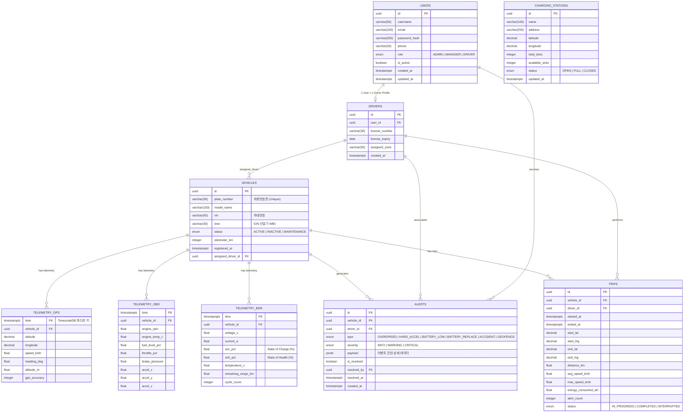

# 데이터베이스 설계서 (Database Design Document)

**프로젝트**: 지능형 오토바이 FMS (Fleet Management System)  
**버전**: v1.0  
**작성일**: 2026-04-13  
**작성자**: Chief System Architect

---

## 1. 개요

본 문서는 지능형 오토바이 FMS 시스템의 데이터베이스 구조를 정의합니다.  
데이터는 두 가지 저장소로 분리 운영됩니다.

| 저장소 | 역할 | 대상 데이터 |
|---|---|---|
| **PostgreSQL** | 마스터/트랜잭션 데이터 | 차량, 사용자, 충전소, 알림 내역 |
| **TimescaleDB** (PostgreSQL 확장) | 시계열 원격측정 데이터 | GPS, OBD, BMS 실시간/이력 데이터 |
| **Redis** | 실시간 캐시 | 마지막 위치, 배터리 상태 등 최신 스냅샷 |

---

## 2. ERD (Entity Relationship Diagram)

---

## 3. 테이블 상세 명세

### 3.1 `users` — 사용자 (운전자/관리자)

| 컬럼 | 타입 | 제약조건 | 설명 |
|---|---|---|---|
| `id` | `UUID` | PK, DEFAULT gen_random_uuid() | 사용자 고유 식별자 |
| `username` | `VARCHAR(50)` | UNIQUE, NOT NULL | 로그인 아이디 |
| `email` | `VARCHAR(100)` | UNIQUE, NOT NULL | 이메일 |
| `password_hash` | `VARCHAR(255)` | NOT NULL | bcrypt 해시 |
| `phone` | `VARCHAR(20)` | | 연락처 |
| `role` | `ENUM` | NOT NULL | ADMIN / MANAGER / DRIVER |
| `is_active` | `BOOLEAN` | DEFAULT TRUE | 계정 활성 여부 |
| `created_at` | `TIMESTAMPTZ` | DEFAULT NOW() | 생성일시 |
| `updated_at` | `TIMESTAMPTZ` | DEFAULT NOW() | 수정일시 |

---

### 3.2 `vehicles` — 차량

| 컬럼 | 타입 | 제약조건 | 설명 |
|---|---|---|---|
| `id` | `UUID` | PK | 차량 고유 식별자 |
| `plate_number` | `VARCHAR(30)` | UNIQUE, NOT NULL | 차량번호판 |
| `model_name` | `VARCHAR(100)` | NOT NULL | 모델명 (예: Honda PCX 125e) |
| `vin` | `VARCHAR(50)` | UNIQUE | 차대번호 |
| `imei` | `VARCHAR(30)` | UNIQUE, NOT NULL | ION 단말기 IMEI |
| `status` | `ENUM` | NOT NULL | ACTIVE / INACTIVE / MAINTENANCE |
| `odometer_km` | `INTEGER` | DEFAULT 0 | 누적 주행거리 |
| `registered_at` | `TIMESTAMPTZ` | DEFAULT NOW() | 등록일시 |
| `assigned_driver_id` | `UUID` | FK → drivers.id, NULLABLE | 배정 운전자 |

---

### 3.3 `drivers` — 운전자 프로필

| 컬럼 | 타입 | 제약조건 | 설명 |
|---|---|---|---|
| `id` | `UUID` | PK | 운전자 식별자 |
| `user_id` | `UUID` | FK → users.id, UNIQUE | 연결된 사용자 계정 |
| `license_number` | `VARCHAR(30)` | UNIQUE, NOT NULL | 운전면허 번호 |
| `license_expiry` | `DATE` | NOT NULL | 면허 만료일 |
| `assigned_zone` | `VARCHAR(50)` | | 담당 구역 |
| `created_at` | `TIMESTAMPTZ` | DEFAULT NOW() | |

---

### 3.4 `charging_stations` — 충전소

| 컬럼 | 타입 | 제약조건 | 설명 |
|---|---|---|---|
| `id` | `UUID` | PK | 충전소 식별자 |
| `name` | `VARCHAR(100)` | NOT NULL | 충전소명 |
| `address` | `VARCHAR(255)` | NOT NULL | 주소 |
| `latitude` | `DECIMAL(10,7)` | NOT NULL | 위도 |
| `longitude` | `DECIMAL(10,7)` | NOT NULL | 경도 |
| `total_slots` | `INTEGER` | NOT NULL | 전체 충전 슬롯 수 |
| `available_slots` | `INTEGER` | NOT NULL | 현재 사용 가능 슬롯 수 |
| `status` | `ENUM` | NOT NULL | OPEN / FULL / CLOSED |
| `updated_at` | `TIMESTAMPTZ` | DEFAULT NOW() | 마지막 상태 갱신 시각 |

> **인덱스**: `(latitude, longitude)`에 PostGIS 공간 인덱스(`GIST`) 적용 → 근처 충전소 탐색 성능 최적화

---

### 3.5 `telemetry_gps` — GPS 원격측정 (TimescaleDB Hypertable)

| 컬럼 | 타입 | 제약조건 | 설명 |
|---|---|---|---|
| `time` | `TIMESTAMPTZ` | NOT NULL, 파티션 키 | 수신 시각 |
| `vehicle_id` | `UUID` | FK → vehicles.id, NOT NULL | |
| `latitude` | `DECIMAL(10,7)` | NOT NULL | 위도 |
| `longitude` | `DECIMAL(10,7)` | NOT NULL | 경도 |
| `speed_kmh` | `FLOAT` | | 현재 속도 (km/h) |
| `heading_deg` | `FLOAT` | | 진행 방향 (0°~360°) |
| `altitude_m` | `FLOAT` | | 고도 (m) |
| `gps_accuracy` | `INTEGER` | | GPS 정밀도 (m) |

> **파티셔닝**: `create_hypertable('telemetry_gps', 'time', chunk_time_interval => INTERVAL '1 day')`  
> **보존 정책**: 90일 초과 데이터 자동 압축/삭제 (`add_retention_policy`)

---

### 3.6 `telemetry_obd` — OBD 원격측정 (TimescaleDB Hypertable)

| 컬럼 | 타입 | 제약조건 | 설명 |
|---|---|---|---|
| `time` | `TIMESTAMPTZ` | NOT NULL, 파티션 키 | |
| `vehicle_id` | `UUID` | FK, NOT NULL | |
| `engine_rpm` | `FLOAT` | | 엔진 RPM |
| `engine_temp_c` | `FLOAT` | | 엔진 온도 (°C) |
| `fuel_level_pct` | `FLOAT` | | 연료 잔량 (%) |
| `throttle_pct` | `FLOAT` | | 스로틀 개도 (%) |
| `brake_pressure` | `FLOAT` | | 브레이크 압력 |
| `accel_x` | `FLOAT` | | X축 가속도 (g) |
| `accel_y` | `FLOAT` | | Y축 가속도 (g) |
| `accel_z` | `FLOAT` | | Z축 가속도 (g) — 충격 감지 |

---

### 3.7 `telemetry_bms` — BMS 원격측정 (TimescaleDB Hypertable)

| 컬럼 | 타입 | 제약조건 | 설명 |
|---|---|---|---|
| `time` | `TIMESTAMPTZ` | NOT NULL, 파티션 키 | |
| `vehicle_id` | `UUID` | FK, NOT NULL | |
| `voltage_v` | `FLOAT` | | 배터리 전압 (V) |
| `current_a` | `FLOAT` | | 배터리 전류 (A) |
| `soc_pct` | `FLOAT` | | 충전 상태 (State of Charge %) |
| `soh_pct` | `FLOAT` | | 배터리 건강 상태 (State of Health %) |
| `temperature_c` | `FLOAT` | | 배터리 온도 (°C) |
| `remaining_range_km` | `FLOAT` | | AI 추정 잔여 주행가능 거리 |
| `cycle_count` | `INTEGER` | | 충방전 사이클 수 |

---

### 3.8 `alerts` — 이벤트/알림 내역

| 컬럼 | 타입 | 제약조건 | 설명 |
|---|---|---|---|
| `id` | `UUID` | PK | |
| `vehicle_id` | `UUID` | FK → vehicles.id, NOT NULL | |
| `driver_id` | `UUID` | FK → drivers.id | 해당 시점 운전자 |
| `type` | `ENUM` | NOT NULL | OVERSPEED / HARD_ACCEL / BATTERY_LOW / BATTERY_REPLACE / ACCIDENT / GEOFENCE |
| `severity` | `ENUM` | NOT NULL | INFO / WARNING / CRITICAL |
| `payload` | `JSONB` | | 이벤트 관련 상세 데이터 (속도값, SOC값 등) |
| `is_resolved` | `BOOLEAN` | DEFAULT FALSE | 처리 여부 |
| `resolved_by` | `UUID` | FK → users.id, NULLABLE | 처리한 관리자 |
| `resolved_at` | `TIMESTAMPTZ` | NULLABLE | 처리 시각 |
| `created_at` | `TIMESTAMPTZ` | DEFAULT NOW() | 이벤트 발생 시각 |

---

### 3.9 `trips` — 운행 이력

| 컬럼 | 타입 | 제약조건 | 설명 |
|---|---|---|---|
| `id` | `UUID` | PK | |
| `vehicle_id` | `UUID` | FK, NOT NULL | |
| `driver_id` | `UUID` | FK, NOT NULL | |
| `started_at` | `TIMESTAMPTZ` | NOT NULL | 운행 시작 시각 |
| `ended_at` | `TIMESTAMPTZ` | NULLABLE | 운행 종료 시각 |
| `start_lat/lng` | `DECIMAL` | | 출발지 좌표 |
| `end_lat/lng` | `DECIMAL` | NULLABLE | 도착지 좌표 |
| `distance_km` | `FLOAT` | | 총 주행거리 |
| `avg_speed_kmh` | `FLOAT` | | 평균 속도 |
| `max_speed_kmh` | `FLOAT` | | 최고 속도 |
| `energy_consumed_wh` | `FLOAT` | | 소비 에너지 |
| `alert_count` | `INTEGER` | DEFAULT 0 | 해당 운행 중 발생 알림 수 |
| `status` | `ENUM` | NOT NULL | IN_PROGRESS / COMPLETED / INTERRUPTED |

---

## 4. Redis 캐시 키 설계

| Key 패턴 | 타입 | TTL | 내용 |
|---|---|---|---|
| `vehicle:{id}:state` | Hash | 60s | 마지막 GPS, 속도, SOC, 엔진상태 스냅샷 |
| `vehicle:{id}:bms` | Hash | 60s | 마지막 BMS 수치 |
| `station:{id}:available` | String | 30s | 충전소 잔여 슬롯 수 |
| `alert:active:{vehicle_id}` | Set | 300s | 미해결 알림 ID 목록 |
| `session:{token}` | Hash | 3600s | 사용자 세션 |
