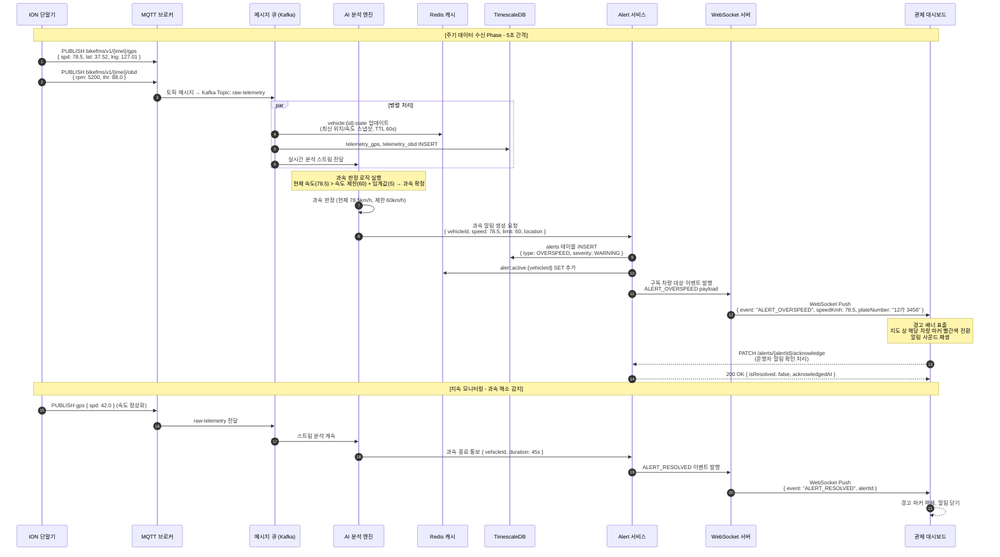
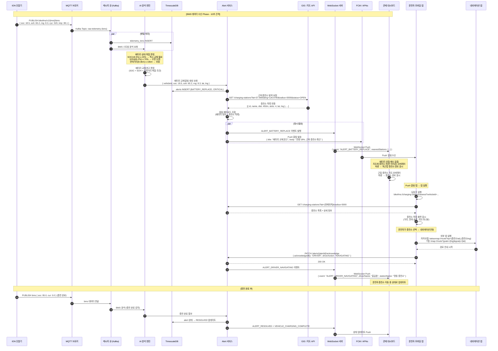

# 시스템 시퀀스 다이어그램 (System Sequence Diagram)

**프로젝트**: 지능형 오토바이 FMS (Fleet Management System)  
**버전**: v1.0  
**작성일**: 2026-04-13  

---

## 시나리오 1: 위험 운행(과속) 감지 및 알림

### 개요

오토바이 단말기(ION)가 주기적으로 GPS/OBD 데이터를 MQTT로 전송하면, 서버의 AI 분석 엔진이 실시간으로 과속 여부를 판단하고 WebSocket을 통해 관제 대시보드에 즉시 경고를 푸시하는 시나리오입니다.

### 참여자

| 참여자 | 설명 |
|---|---|
| `ION 단말기` | 오토바이에 장착된 데이터 수집 노드 |
| `MQTT 브로커` | 단말기 수신 메시지 처리 (Mosquitto/EMQX) |
| `메시지 큐` | 비동기 처리 버퍼 (Apache Kafka) |
| `AI 분석 엔진` | 과속/급가속 판정 서비스 |
| `Redis` | 실시간 상태 캐시 |
| `TimescaleDB` | 시계열 이력 데이터 저장 |
| `Alert 서비스` | 알림 생성 및 발송 서비스 |
| `WebSocket 서버` | 대시보드/앱 실시간 푸시 |
| `관제 대시보드` | 운영자 웹 클라이언트 (Vue3) |

### 시퀀스 다이어그램

### 단계별 설명

| 단계 | 설명 |
|---|---|
| **1~2** | ION 단말기가 5초 주기로 GPS(위치/속도) 및 OBD(RPM/스로틀) 데이터를 TLS 암호화된 MQTT 채널로 발행합니다. |
| **3** | MQTT 브로커는 수신한 메시지를 Kafka `raw-telemetry` 토픽으로 즉시 포워딩합니다. |
| **4~6** | Kafka 컨슈머 그룹이 메시지를 병렬 처리합니다: Redis에 최신 상태 캐싱, TimescaleDB에 이력 저장, AI 엔진으로 분석 스트림 전달. |
| **7** | AI 분석 엔진은 현재 속도가 도로 제한 속도 + 임계값(기본 5km/h)을 초과하면 과속으로 판정합니다. |
| **8~10** | Alert 서비스가 DB에 알림을 기록하고, Redis에 활성 알림 마킹 후, WebSocket 서버로 이벤트를 전달합니다. |
| **11** | WebSocket 서버는 해당 차량을 구독 중인 모든 대시보드 클라이언트에게 즉시 푸시합니다. |
| **12~13** | 대시보드에서 경고 배너 및 빨간 마커가 표출되며, 운영자가 확인 처리(ACK)합니다. |
| **14~18** | 이후 속도가 정상화되면 동일 파이프라인을 통해 알림 해제 이벤트가 전파됩니다. |

---

## 시나리오 2: 배터리 교체 권고 및 충전소 안내

### 개요

ION 단말기의 BMS 데이터를 AI가 분석하여 배터리 잔량 부족 또는 수명 도래를 감지하면, 관제 대시보드와 운전자 모바일 앱에 동시에 알림을 발송하고 근처 충전소 탐색 및 네비게이션 연동까지 안내하는 시나리오입니다.

### 참여자

| 참여자 | 설명 |
|---|---|
| `ION 단말기` | BMS 데이터 수집 및 전송 |
| `MQTT 브로커` | 메시지 수신 |
| `메시지 큐` | 비동기 처리 버퍼 |
| `AI 분석 엔진` | 배터리 수명 예측 모델 |
| `Alert 서비스` | 알림 생성, FCM/APNs 발송 |
| `GIS API` | 근처 충전소 좌표 기반 탐색 |
| `WebSocket 서버` | 대시보드 실시간 푸시 |
| `관제 대시보드` | 운영자 웹 클라이언트 |
| `모바일 앱` | 운전자 앱 (React Native / Flutter) |
| `네비게이션 앱` | 외부 지도 앱 (카카오맵/T맵) |

### 시퀀스 다이어그램

### 단계별 설명

| 단계 | 설명 |
|---|---|
| **1~2** | ION 단말기가 10초 주기로 BMS 데이터(SOC, SOH, 온도, 잔여거리, 사이클수)를 전송합니다. |
| **3~4** | Kafka를 통해 TimescaleDB 저장과 AI 분석이 병렬로 수행됩니다. |
| **5** | AI 분석 엔진은 SOC ≤ 20%, SOH ≤ 70%, 잔여거리 ≤ 10km 세 가지 복합 조건을 평가하여 교체 권고를 결정합니다. |
| **6~8** | Alert 서비스가 DB에 기록 후 GIS API를 호출하여 현재 차량 위치 기준 반경 3km 내 이용 가능한 충전소 목록을 실시간으로 조회합니다. |
| **9~10** | WebSocket(대시보드용)과 FCM/APNs(운전자 앱용)로 동시에 알림을 발송합니다. |
| **11~13** | 관제 대시보드는 지도에 충전소 핀과 최적 경로를 즉시 오버레이합니다. |
| **14~16** | 운전자가 Push 알림을 탭하면 앱이 딥링크로 열리고, 서버에서 충전소 목록을 재조회하여 화면에 표시합니다. |
| **17~18** | 운전자가 충전소를 선택하면 카카오맵/T맵 외부 앱으로 경로 안내가 시작됩니다. |
| **19~20** | 앱이 Alert 서비스에 운전자 행동(이동 중)을 보고하고, 대시보드에서 이 상태가 실시간으로 반영됩니다. |
| **21~25** | 충전 완료 시 BMS 데이터가 정상화되고, 동일 파이프라인을 통해 알림이 자동 해제됩니다. |
