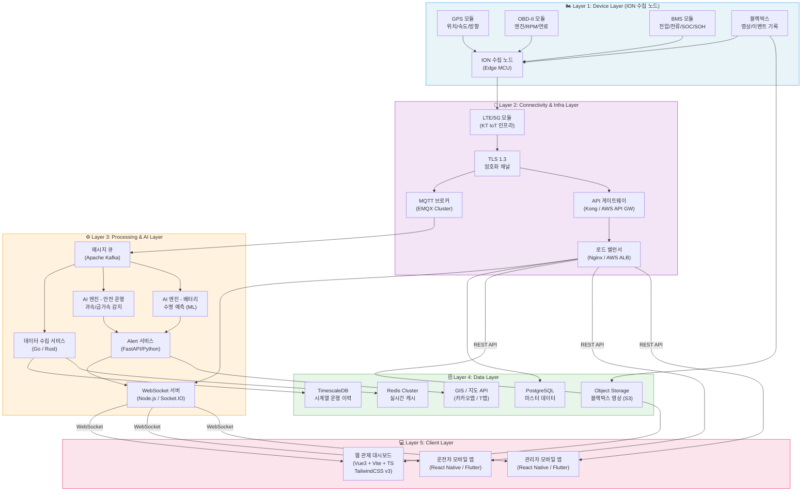
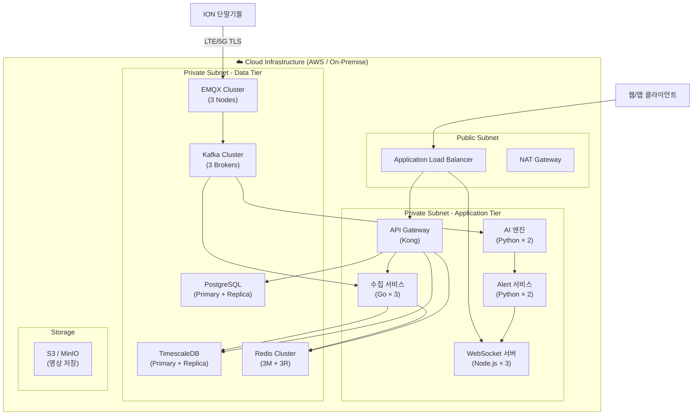

# 시스템 아키텍처 상세 정의서 (System Architecture Document)

**프로젝트**: 지능형 오토바이 FMS (Fleet Management System)  
**버전**: v1.0  
**작성일**: 2026-04-13  
**작성자**: Chief System Architect

---

## 1. 아키텍처 개요

지능형 오토바이 FMS는 **5계층 아키텍처**로 구성됩니다. 각 계층은 독립적으로 확장 가능하며(Horizontal Scaling), 계층 간 결합도를 최소화하여 장애 격리(Fault Isolation)를 보장합니다.



---

## 2. 계층별 상세 정의

### Layer 1: Device Layer (ION 수집 노드)

#### 2.1.1 역할 및 책임

ION(IoT On-bike Node) 수집 노드는 오토바이에 직접 장착되어 다중 센서 데이터를 통합 수집하고 서버로 전송하는 엣지 디바이스입니다.

#### 2.1.2 컴포넌트 상세

| 컴포넌트 | 규격 | 수집 데이터 | 전송 주기 |
|---|---|---|---|
| **GPS 모듈** | u-blox M9N / MediaTek | 위도, 경도, 고도, 속도(km/h), 방향각(heading), GPS 정확도 | 5초 |
| **OBD-II 인터페이스** | SAE J1939 / CAN Bus | 엔진 RPM, 엔진 온도(°C), 연료 잔량(%), 스로틀 개도(%), 브레이크 압력 | 5초 |
| **BMS 인터페이스** | CAN Bus / UART | 배터리 전압(V), 전류(A), SOC(%), SOH(%), 온도(°C), 충방전 사이클 | 10초 |
| **블랙박스 모듈** | 2CH CMOS 카메라 | 전방/후방 영상(FHD 30fps), 충격 이벤트 클립(G-sensor 트리거) | 이벤트 기반 |
| **MCU/통신 모듈** | Qualcomm SDX12 | 데이터 통합, LTE/5G 전송, OTA 펌웨어 업데이트 | - |

#### 2.1.3 엣지 처리 로직

```
센서 데이터 수집 (Raw)
    ↓
데이터 유효성 검증 (Null 체크, 범위 이탈 필터링)
    ↓
페이로드 직렬화 (JSON, MessagePack)
    ↓
로컬 버퍼링 (네트워크 단절 시 최대 1시간 데이터 저장)
    ↓
LTE/5G → MQTT TLS 전송
```

> **엣지 버퍼링**: 네트워크 끊김 시 SD카드/플래시 메모리에 최대 1시간분 데이터를 로컬 저장 후 연결 복구 시 일괄 전송합니다.

---

### Layer 2: Connectivity & Infra Layer

#### 2.2.1 역할 및 책임

단말기와 서버 사이의 안정적이고 보안된 데이터 전달 경로를 제공하며, 대용량 동시 연결을 처리합니다.

#### 2.2.2 컴포넌트 상세

| 컴포넌트 | 기술 스택 | 역할 |
|---|---|---|
| **통신망** | LTE Cat-M1 / 5G NR (KT IoT 인프라) | 단말기 → 서버 무선 연결 |
| **TLS 암호화** | TLS 1.3, X.509 클라이언트 인증서 | MQTT/HTTP 전 구간 암호화 |
| **MQTT 브로커** | EMQX 5.x Enterprise (클러스터) | 단말기 연결 관리, 메시지 라우팅, QoS 보장 |
| **API 게이트웨이** | Kong Gateway / AWS API Gateway | REST API 진입점, 인증/인가(JWT 검증), Rate Limiting, 로깅 |
| **로드 밸런서** | Nginx (L7) / AWS ALB | 백엔드 서비스 트래픽 분산, 헬스체크, SSL 종단 |

#### 2.2.3 MQTT 클러스터 설계

```
ION 단말기 (10,000+대)
        ↓ TLS:8883
[EMQX Node 1] [EMQX Node 2] [EMQX Node 3]
        ↓ 클러스터 내부 라우팅
[EMQX Bridge → Kafka]
```

- **클러스터 구성**: EMQX 3노드 이상, 각 노드 10만 동시 연결 지원
- **QoS 1 (At Least Once)**: 데이터 손실 방지
- **Keep-alive**: 60초 (네트워크 이상 감지)
- **ACL(Access Control)**: IMEI 기반 토픽 발행 권한 제한 (자신의 IMEI 토픽만 발행 가능)

---

### Layer 3: Processing & AI Layer

#### 2.3.1 역할 및 책임

수집된 원시 데이터를 실시간으로 분석하여 인사이트(위험 운행, 배터리 상태)를 도출하고, 클라이언트로의 실시간 데이터 스트리밍을 처리합니다.

#### 2.3.2 컴포넌트 상세

| 컴포넌트 | 기술 스택 | 역할 |
|---|---|---|
| **메시지 큐** | Apache Kafka 3.x | MQTT 메시지 버퍼링, 컨슈머 그룹 기반 병렬 처리, 이벤트 소싱 |
| **데이터 수집 서비스** | Go 1.22 / Rust | Kafka 컨슈밍, 데이터 파싱/변환, DB/Redis 기록 |
| **AI 안전 운행 엔진** | Python (FastAPI + Faust) | 과속/급가속/급제동/사고 실시간 스트림 분석 |
| **AI 배터리 예측 엔진** | Python (PyTorch + ONNX) | SOH 기반 배터리 잔여 수명 예측, 교체 시점 권고 |
| **Alert 서비스** | Python (FastAPI) | 알림 생성, 중복 방지, WebSocket/FCM 발송 조율 |
| **WebSocket 서버** | Node.js 20 + Socket.IO | 대시보드/앱 실시간 연결 관리, 구독 기반 이벤트 라우팅 |

#### 2.3.3 Kafka 토픽 구조

| Topic | Partition | Retention | 설명 |
|---|---|---|---|
| `raw-telemetry` | 30 | 7일 | MQTT로 수신한 모든 원시 데이터 |
| `ai-analysis-input` | 10 | 1일 | AI 엔진 분석용 정제 데이터 |
| `alert-events` | 10 | 30일 | 생성된 알림 이벤트 |
| `dashboard-push` | 5 | 1시간 | 대시보드 WebSocket 푸시 큐 |

#### 2.3.4 AI 엔진 상세 - 안전 운행 분석

```python
# 과속 판정 로직 (의사코드)
def detect_overspeed(gps_data: GPSData, road_speed_limit: float) -> Optional[Alert]:
    THRESHOLD = 5.0  # km/h 여유 임계값
    DURATION_SEC = 3  # 3초 이상 지속 시 확정
    
    if gps_data.speed_kmh > (road_speed_limit + THRESHOLD):
        if overspeed_duration >= DURATION_SEC:
            return Alert(type=OVERSPEED, severity=WARNING, ...)
    return None

# 급가속 판정 로직
def detect_hard_acceleration(obd_data: OBDData) -> Optional[Alert]:
    ACCEL_THRESHOLD_G = 0.6  # 0.6g 이상
    
    accel_magnitude = sqrt(obd_data.ax**2 + obd_data.ay**2)
    if accel_magnitude > ACCEL_THRESHOLD_G:
        return Alert(type=HARD_ACCEL, severity=WARNING, ...)
```

#### 2.3.5 AI 엔진 상세 - 배터리 수명 예측

```
입력 피처 (Feature Vector):
  - SOC 시계열 (최근 100회)
  - SOH 시계열 (최근 30일)
  - 충방전 사이클 수
  - 평균 충전 온도
  - 평균 방전 전류

모델: LSTM 기반 회귀 모델 (PyTorch)
출력:
  - 잔여 수명 예측 (일수)
  - 교체 권고 여부 (boolean)
  - 잔여 주행 가능 거리 (km)

교체 권고 트리거:
  - SOH ≤ 70% (배터리 노화)
  - SOC ≤ 20% + 잔여거리 ≤ 10km (즉시 충전 필요)
  - 잔여 수명 예측 ≤ 14일 (사전 교체 권고)
```

#### 2.3.6 WebSocket 서버 구독 관리

```
클라이언트 연결 시:
  1. JWT 토큰 검증
  2. 사용자 역할 확인 (ADMIN/MANAGER: 전체 차량, DRIVER: 배정 차량만)
  3. Redis에 소켓 세션 등록: session:{userId} = {socketId, subscribedVehicles[]}

이벤트 라우팅:
  Alert 서비스 → Kafka(dashboard-push) → WebSocket 서버
  → 구독 중인 소켓에만 선택적 발송 (Room 기반)
```

---

### Layer 4: Data Layer

#### 2.4.1 역할 및 책임

모든 데이터의 영구 저장, 고속 조회, 실시간 캐싱을 담당합니다.

#### 2.4.2 컴포넌트 상세

| 컴포넌트 | 기술 스택 | 저장 데이터 | 규모 기준 |
|---|---|---|---|
| **시계열 DB** | TimescaleDB 2.x (PostgreSQL 16 기반) | GPS/OBD/BMS 원격측정 이력 | 1만 대 × 5초 = 초당 2,000 rows 입력 |
| **마스터 DB** | PostgreSQL 16 (Primary-Replica) | 차량, 사용자, 충전소, 알림, 운행 이력 | 수십만 건 수준 |
| **실시간 캐시** | Redis 7.x Cluster (3 Master + 3 Replica) | 차량 최신 상태, 활성 알림, 세션 | 모든 운행 차량 상태 상주 |
| **영상 저장소** | AWS S3 / MinIO | 블랙박스 영상, 이벤트 클립 | GB ~ TB 규모 |
| **GIS / 지도** | 카카오맵 API / T맵 API | 역지오코딩, 근처 충전소 탐색, 경로 안내 | 외부 API 호출 |

#### 2.4.3 TimescaleDB 파티셔닝 전략

```sql
-- GPS 하이퍼테이블 생성
SELECT create_hypertable(
    'telemetry_gps',
    'time',
    chunk_time_interval => INTERVAL '1 day',
    partitioning_column => 'vehicle_id',
    number_partitions => 16
);

-- 자동 데이터 보존 정책 (90일 초과 삭제)
SELECT add_retention_policy('telemetry_gps', INTERVAL '90 days');

-- 자동 압축 정책 (7일 초과 데이터 압축)
SELECT add_compression_policy('telemetry_gps', INTERVAL '7 days');
```

**성능 목표**:
- 최근 1시간 차량 경로 조회: **< 100ms**
- 30일 운행 이력 집계: **< 2s**

#### 2.4.4 Redis 데이터 구조 설계

```
# 차량 실시간 상태 (Hash)
HSET vehicle:550e...:state
  lat        "37.5665"
  lng        "126.9780"
  speed_kmh  "45.3"
  soc_pct    "72.5"
  engine_tmp "88.5"
  updated_at "2026-04-13T09:00:00Z"
EXPIRE vehicle:550e...:state 60  # 60초 TTL

# 활성 알림 목록 (Set)
SADD alert:active:550e... "alert-uuid-001"
EXPIRE alert:active:550e... 300

# 충전소 잔여 슬롯 (String)
SET station:station-uuid-001:available "4"
EXPIRE station:station-uuid-001:available 30
```

---

### Layer 5: Client Layer

#### 2.5.1 역할 및 책임

운영자(관제 담당자)와 운전자에게 최적화된 UI/UX를 제공하며, 실시간 데이터를 시각적으로 표출합니다.

#### 2.5.2 웹 관제 대시보드 (Vue3)

| 항목 | 기술 |
|---|---|
| **프레임워크** | Vue 3.x + Composition API |
| **빌드** | Vite 5.x |
| **언어** | TypeScript 5.x |
| **스타일링** | TailwindCSS v3 |
| **상태관리** | Pinia |
| **지도** | Kakao Maps SDK / Leaflet.js |
| **실시간 통신** | Socket.IO Client |
| **HTTP 클라이언트** | Axios |
| **차트/그래프** | ECharts / Chart.js |

**프로젝트 디렉터리 구조**:
```
src/
├── components/
│   ├── map/
│   │   ├── VehicleMarker.vue      # 차량 위치 핀
│   │   ├── StationOverlay.vue     # 충전소 오버레이
│   │   └── RoutePolyline.vue      # 경로 표시
│   ├── dashboard/
│   │   ├── VehicleStatusCard.vue  # 차량 상태 카드
│   │   ├── AlertBanner.vue        # 실시간 경고 배너
│   │   └── BatteryGauge.vue       # 배터리 게이지
│   └── common/
│       ├── BaseTable.vue
│       └── BaseModal.vue
├── views/
│   ├── DashboardView.vue          # 메인 관제 화면
│   ├── VehicleListView.vue        # 차량 목록
│   ├── TripHistoryView.vue        # 운행 이력
│   └── AlertManagementView.vue    # 알림 관리
├── stores/
│   ├── vehicleStore.ts            # 차량 상태 (Pinia)
│   ├── alertStore.ts              # 알림 상태
│   └── socketStore.ts             # WebSocket 연결
├── services/
│   ├── api.ts                     # Axios 인스턴스
│   ├── vehicleApi.ts
│   └── alertApi.ts
└── composables/
    ├── useRealtimeVehicle.ts      # WebSocket 실시간 훅
    └── useNearbyStations.ts       # 근처 충전소 조회 훅
```

#### 2.5.3 모바일 앱

| 항목 | 기술 |
|---|---|
| **프레임워크** | React Native / Flutter |
| **실시간 통신** | Socket.IO Client / WebSocket |
| **지도** | 카카오맵 SDK / T맵 SDK |
| **Push 알림** | Firebase Cloud Messaging (FCM) / APNs |
| **딥링크** | Universal Links / App Links |

---

## 3. 인프라 배포 아키텍처



---

## 4. 보안 아키텍처

| 구간 | 보안 수단 |
|---|---|
| 단말기 ↔ MQTT 브로커 | TLS 1.3 + X.509 클라이언트 인증서 |
| 클라이언트 ↔ API 게이트웨이 | HTTPS(TLS 1.3) + JWT (RS256) |
| API 게이트웨이 ↔ 내부 서비스 | 내부망 mTLS |
| WebSocket 연결 | WSS + JWT 토큰 검증 |
| 데이터베이스 접근 | 내부망 격리 + 서비스 계정별 최소 권한 |
| 블랙박스 영상 | S3 Server-Side Encryption (AES-256) |

---

## 5. 비기능 요구사항 목표치

| 항목 | 목표 | 수단 |
|---|---|---|
| **실시간 지연시간** | 단말 → 대시보드 < 2초 | Kafka + WebSocket |
| **가용성** | 99.9% (월 43분 이하 다운타임) | 클러스터 + 이중화 |
| **단말 동시 연결** | 10,000대 | EMQX 클러스터 |
| **대시보드 동시 접속** | 500명 | Node.js + 수평 확장 |
| **API 응답시간** | 95th percentile < 300ms | Redis 캐시 + 인덱스 |
| **데이터 보존** | 시계열 90일, 마스터 영구 | 보존 정책 자동화 |
| **영상 저장** | 30일 자동 삭제 | S3 Lifecycle 정책 |
