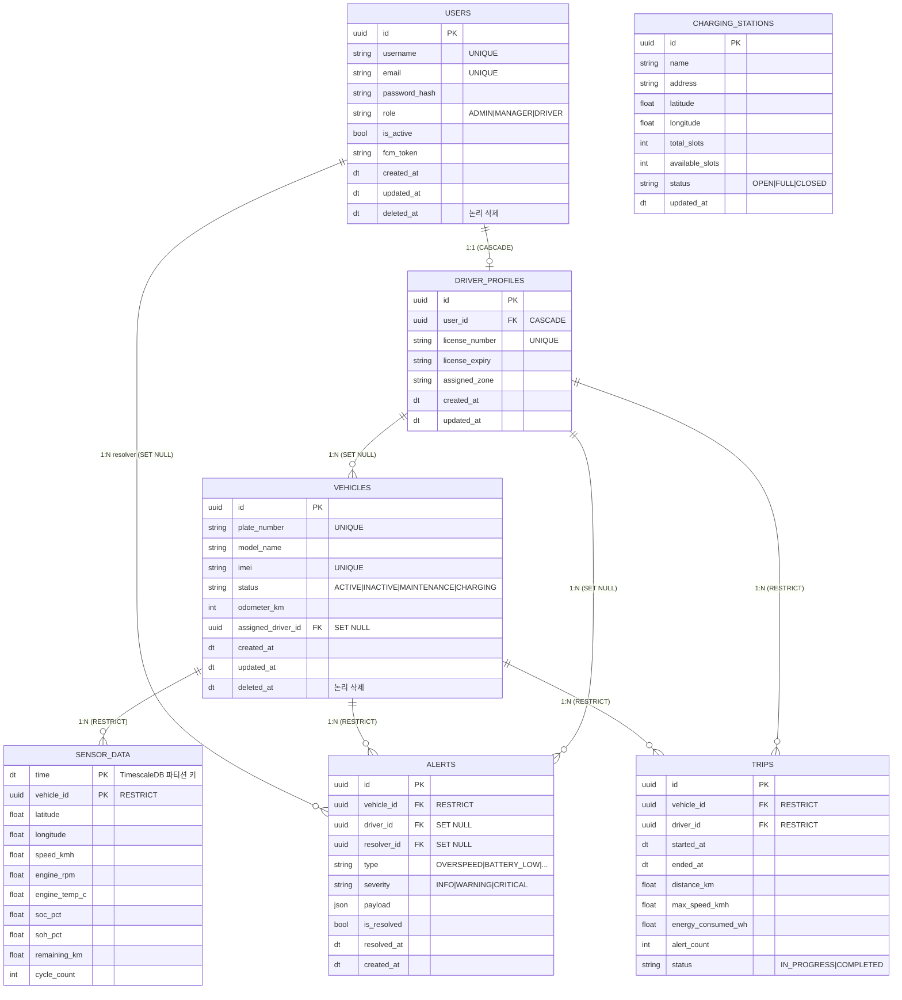

# 데이터베이스 모델 정의서 (Database Model)

**프로젝트**: 지능형 오토바이 FMS  
**버전**: v1.0 | **작성일**: 2026-04-13  
**기술 스택**: Python 3.12, SQLModel 0.0.21, PostgreSQL 16 / TimescaleDB 2.x

---

## 1. 설계 원칙

| 원칙 | 내용 |
|---|---|
| **단일 진실 공급원** | SQLModel 클래스가 Pydantic 스키마와 DB 테이블 정의를 동시에 담당 |
| **Soft Delete** | 마스터 데이터(Vehicle, User)는 물리 삭제 금지 — `deleted_at` 컬럼으로 논리 삭제 |
| **Cascade 명시** | 모든 FK에 ondelete 정책 명시. 시계열 데이터는 차량 삭제 후에도 보존 |
| **UUID PK** | 분산 환경과 외부 노출 안전성을 위해 모든 PK는 UUID |
| **Timezone-aware** | 모든 datetime은 `TIMESTAMP WITH TIME ZONE` (UTC 저장, 표시 시 변환) |

---

## 2. 공통 Base 모델

```python
# chalicelib/models/base.py
from datetime import datetime, timezone
from typing import Optional
from sqlmodel import SQLModel, Field
from sqlalchemy import Column, DateTime


def utcnow() -> datetime:
    return datetime.now(timezone.utc)


class TimeStampMixin(SQLModel):
    """
    생성/수정 시각 자동 관리 Mixin.
    - created_at: 최초 삽입 시 자동 설정
    - updated_at: 삽입 시 설정 + DB 레벨 onupdate 트리거로 자동 갱신
    SQLModel 자체는 onupdate를 지원하지 않으므로 sa_column으로 직접 설정.
    """
    created_at: datetime = Field(
        default_factory=utcnow,
        nullable=False,
        sa_column=Column(DateTime(timezone=True), nullable=False, default=utcnow)
    )
    updated_at: datetime = Field(
        default_factory=utcnow,
        nullable=False,
        sa_column=Column(
            DateTime(timezone=True),
            nullable=False,
            default=utcnow,
            onupdate=utcnow   # ← DB 레벨 자동 갱신
        )
    )


class SoftDeleteMixin(SQLModel):
    """논리 삭제 Mixin — 물리 삭제 대신 deleted_at 마킹"""
    deleted_at: Optional[datetime] = Field(
        default=None,
        nullable=True,
        sa_column=Column(DateTime(timezone=True), nullable=True)
    )

    @property
    def is_deleted(self) -> bool:
        return self.deleted_at is not None
```

> **Mixin 패턴 주의**: `TimeStampMixin`과 `SoftDeleteMixin`은 `table=True` 없이 선언합니다.  
> `table=True`를 가진 자식 모델에서만 실제 테이블 컬럼으로 매핑됩니다.  
> SQLModel의 다중 상속 시 `class Vehicle(TimeStampMixin, SoftDeleteMixin, table=True)` 순서를 유지하세요.

---

## 3. 엔티티 모델 정의

### 3.1 User — 사용자

```python
# chalicelib/models/user.py
from enum import Enum
from typing import Optional, List, TYPE_CHECKING
from uuid import UUID, uuid4
from sqlmodel import SQLModel, Field, Relationship
from .base import TimeStampMixin, SoftDeleteMixin

if TYPE_CHECKING:
    from .vehicle import Vehicle
    from .alert import Alert


class UserRole(str, Enum):
    ADMIN   = "ADMIN"
    MANAGER = "MANAGER"
    DRIVER  = "DRIVER"


# ── Table 모델 (DB 실체) ────────────────────────────────────────────
class User(TimeStampMixin, SoftDeleteMixin, table=True):
    __tablename__ = "users"

    id            : UUID            = Field(default_factory=uuid4, primary_key=True)
    username      : str             = Field(max_length=50, unique=True, index=True)
    email         : str             = Field(max_length=100, unique=True)
    password_hash : str             = Field(max_length=255)
    phone         : Optional[str]   = Field(default=None, max_length=20)
    role          : UserRole        = Field(default=UserRole.DRIVER)
    is_active     : bool            = Field(default=True)
    fcm_token     : Optional[str]   = Field(default=None, max_length=512)

    # ── Relationships ──────────────────────────────────────────────
    # User 1 ─── 0..1 DriverProfile
    driver_profile: Optional["DriverProfile"] = Relationship(back_populates="user")

    # User (MANAGER/ADMIN) 1 ─── N Alert (처리자)
    resolved_alerts: List["Alert"] = Relationship(back_populates="resolver")


class DriverProfile(TimeStampMixin, table=True):
    """운전자 상세 프로필 (role=DRIVER 인 User와 1:1)"""
    __tablename__ = "driver_profiles"

    id             : UUID          = Field(default_factory=uuid4, primary_key=True)
    user_id        : UUID          = Field(foreign_key="users.id", unique=True, ondelete="CASCADE")
    license_number : str           = Field(max_length=30, unique=True)
    license_expiry : str           = Field(max_length=10)   # "YYYY-MM-DD"
    assigned_zone  : Optional[str] = Field(default=None, max_length=100)

    # ── Relationships ──────────────────────────────────────────────
    user    : User              = Relationship(back_populates="driver_profile")
    # DriverProfile 1 ─── N Vehicle (배정 차량)
    vehicles: List["Vehicle"]  = Relationship(back_populates="assigned_driver")
    # DriverProfile 1 ─── N Alert (연관 운전자)
    alerts  : List["Alert"]    = Relationship(back_populates="driver")
    # DriverProfile 1 ─── N Trip
    trips   : List["Trip"]     = Relationship(back_populates="driver")
```

> **Cascade 정책**: `User` 삭제(논리 삭제) 시 `DriverProfile`은 `CASCADE` 물리 삭제.  
> `DriverProfile` 삭제 시 `Vehicle.assigned_driver_id`는 `SET NULL` — 차량 데이터는 유지.

---

### 3.2 Vehicle — 차량

```python
# chalicelib/models/vehicle.py
from enum import Enum
from typing import Optional, List, TYPE_CHECKING
from uuid import UUID, uuid4
from sqlmodel import SQLModel, Field, Relationship
from .base import TimeStampMixin, SoftDeleteMixin

if TYPE_CHECKING:
    from .user import DriverProfile
    from .sensor import SensorData
    from .alert import Alert
    from .trip import Trip


class VehicleStatus(str, Enum):
    ACTIVE      = "ACTIVE"
    INACTIVE    = "INACTIVE"
    MAINTENANCE = "MAINTENANCE"
    CHARGING    = "CHARGING"


class Vehicle(TimeStampMixin, SoftDeleteMixin, table=True):
    __tablename__ = "vehicles"

    id                 : UUID                = Field(default_factory=uuid4, primary_key=True)
    plate_number       : str                 = Field(max_length=30, unique=True, index=True)
    model_name         : str                 = Field(max_length=100)
    vin                : Optional[str]       = Field(default=None, max_length=50, unique=True)
    imei               : str                 = Field(max_length=30, unique=True, index=True)
    status             : VehicleStatus       = Field(default=VehicleStatus.ACTIVE)
    odometer_km        : int                 = Field(default=0)
    assigned_driver_id : Optional[UUID]      = Field(
                             default=None,
                             foreign_key="driver_profiles.id",
                             ondelete="SET NULL"   # 운전자 삭제 시 차량은 미배정 상태로 유지
                         )

    # ── Relationships ──────────────────────────────────────────────
    assigned_driver : Optional["DriverProfile"] = Relationship(back_populates="vehicles")

    # Vehicle 1 ─── N SensorData
    # ondelete="RESTRICT" — 차량 논리 삭제 전 센서 데이터는 TimescaleDB에 보존
    sensor_data     : List["SensorData"]        = Relationship(back_populates="vehicle")

    # Vehicle 1 ─── N Alert
    alerts          : List["Alert"]             = Relationship(back_populates="vehicle")

    # Vehicle 1 ─── N Trip
    trips           : List["Trip"]              = Relationship(back_populates="vehicle")
```

> **Cascade 정책**:
> - `Vehicle` 논리 삭제(`deleted_at` 설정) → 연결 `SensorData`/`Alert`/`Trip`은 **물리적으로 보존** (규제/감사 목적)  
> - 완전 물리 삭제 시 `SensorData`는 `RESTRICT` — 데이터 존재 시 삭제 불가 (명시적 데이터 정리 프로세스 필요)

---

### 3.3 SensorData — 센서 원격측정 (TimescaleDB Hypertable)

```python
# chalicelib/models/sensor.py
from typing import Optional, TYPE_CHECKING
from uuid import UUID
from datetime import datetime
from sqlmodel import SQLModel, Field, Relationship, Column
from sqlalchemy import Index
from .base import utcnow

if TYPE_CHECKING:
    from .vehicle import Vehicle


class SensorData(SQLModel, table=True):
    """
    GPS + OBD + BMS 통합 센서 테이블.
    TimescaleDB Hypertable: partition_key = time, vehicle_id
    INSERT 전용 — UPDATE/DELETE 없음.
    """
    __tablename__ = "sensor_data"
    __table_args__ = (
        # 복합 인덱스: 특정 차량의 최근 데이터 조회 최적화
        Index("ix_sensor_vehicle_time", "vehicle_id", "time"),
    )

    # ── PK: 시계열 복합 키 ─────────────────────────────────────────
    time       : datetime      = Field(default_factory=utcnow, primary_key=True)
    vehicle_id : UUID          = Field(foreign_key="vehicles.id", primary_key=True,
                                       ondelete="RESTRICT")

    # ── GPS 데이터 ────────────────────────────────────────────────
    latitude   : Optional[float] = Field(default=None)
    longitude  : Optional[float] = Field(default=None)
    altitude_m : Optional[float] = Field(default=None)
    speed_kmh  : Optional[float] = Field(default=None)
    heading_deg: Optional[float] = Field(default=None)
    gps_acc_m  : Optional[int]   = Field(default=None)   # 정확도 반경 (m)

    # ── OBD 데이터 ────────────────────────────────────────────────
    engine_rpm    : Optional[float] = Field(default=None)
    engine_temp_c : Optional[float] = Field(default=None)
    fuel_pct      : Optional[float] = Field(default=None)
    throttle_pct  : Optional[float] = Field(default=None)
    brake_pressure: Optional[float] = Field(default=None)
    accel_x       : Optional[float] = Field(default=None)
    accel_y       : Optional[float] = Field(default=None)
    accel_z       : Optional[float] = Field(default=None)

    # ── BMS 데이터 ────────────────────────────────────────────────
    voltage_v      : Optional[float] = Field(default=None)
    current_a      : Optional[float] = Field(default=None)
    soc_pct        : Optional[float] = Field(default=None)   # State of Charge
    soh_pct        : Optional[float] = Field(default=None)   # State of Health
    battery_temp_c : Optional[float] = Field(default=None)
    remaining_km   : Optional[float] = Field(default=None)   # AI 추정 잔여거리
    cycle_count    : Optional[int]   = Field(default=None)

    # ── Relationship ──────────────────────────────────────────────
    vehicle: "Vehicle" = Relationship(back_populates="sensor_data")
```

> **Cascade 정책**: `RESTRICT` — Vehicle 삭제 전 SensorData가 존재하면 DB 레벨에서 차단.  
> **데이터 보존 정책**: TimescaleDB retention policy로 91일 초과 데이터 자동 압축, 2년 초과 삭제.

---

### 3.4 Alert — 이벤트/알림

```python
# chalicelib/models/alert.py
from enum import Enum
from typing import Optional, Any, Dict, TYPE_CHECKING
from uuid import UUID, uuid4
from sqlmodel import SQLModel, Field, Relationship, Column
from sqlalchemy import JSON
from .base import TimeStampMixin, utcnow

if TYPE_CHECKING:
    from .vehicle import Vehicle
    from .user import DriverProfile, User


class AlertType(str, Enum):
    OVERSPEED      = "OVERSPEED"
    HARD_ACCEL     = "HARD_ACCEL"
    HARD_BRAKE     = "HARD_BRAKE"
    BATTERY_LOW    = "BATTERY_LOW"
    BATTERY_REPLACE= "BATTERY_REPLACE"
    ACCIDENT       = "ACCIDENT"
    GEOFENCE_EXIT  = "GEOFENCE_EXIT"
    ENGINE_ANOMALY = "ENGINE_ANOMALY"


class AlertSeverity(str, Enum):
    INFO     = "INFO"
    WARNING  = "WARNING"
    CRITICAL = "CRITICAL"


class Alert(TimeStampMixin, table=True):
    __tablename__ = "alerts"

    id          : UUID          = Field(default_factory=uuid4, primary_key=True)
    vehicle_id  : UUID          = Field(foreign_key="vehicles.id", ondelete="RESTRICT",
                                        index=True)
    driver_id   : Optional[UUID]= Field(default=None, foreign_key="driver_profiles.id",
                                        ondelete="SET NULL")
    type        : AlertType     = Field(index=True)
    severity    : AlertSeverity = Field(index=True)
    payload     : Dict[str, Any]= Field(default={}, sa_column=Column(JSON))
    is_resolved : bool          = Field(default=False, index=True)
    resolver_id : Optional[UUID]= Field(default=None, foreign_key="users.id",
                                        ondelete="SET NULL")
    resolved_at : Optional[Any] = Field(default=None)

    # ── Relationships ──────────────────────────────────────────────
    vehicle : "Vehicle"              = Relationship(back_populates="alerts")
    driver  : Optional["DriverProfile"] = Relationship(back_populates="alerts")
    resolver: Optional["User"]       = Relationship(back_populates="resolved_alerts")
```

> **Cascade 정책**:
> - `vehicle_id`: `RESTRICT` — 알림이 있는 차량은 삭제 불가  
> - `driver_id`: `SET NULL` — 운전자 삭제 시 알림은 보존, driver_id만 NULL  
> - `resolver_id`: `SET NULL` — 처리자 계정 삭제 시 알림은 보존

---

### 3.5 ChargingStation — 충전소

```python
# chalicelib/models/charging_station.py
from typing import Optional
from uuid import UUID, uuid4
from enum import Enum
from sqlmodel import SQLModel, Field
from .base import TimeStampMixin


class StationStatus(str, Enum):
    OPEN   = "OPEN"
    FULL   = "FULL"
    CLOSED = "CLOSED"


class ChargingStation(TimeStampMixin, table=True):
    __tablename__ = "charging_stations"

    id               : UUID          = Field(default_factory=uuid4, primary_key=True)
    name             : str           = Field(max_length=100)
    address          : str           = Field(max_length=255)
    latitude         : float         = Field()
    longitude        : float         = Field()
    total_slots      : int           = Field(ge=1)
    available_slots  : int           = Field(ge=0)
    status           : StationStatus = Field(default=StationStatus.OPEN)
    operator_contact : Optional[str] = Field(default=None, max_length=50)
```

> **FK 없음**: 충전소는 독립 마스터 데이터. `available_slots`는 Redis에서 실시간 관리되며, DB에는 주기적 동기화 값이 저장됩니다.

---

### 3.6 Trip — 운행 이력

```python
# chalicelib/models/trip.py
from datetime import datetime
from enum import Enum
from typing import Optional, TYPE_CHECKING
from uuid import UUID, uuid4
from sqlmodel import SQLModel, Field, Relationship
from sqlalchemy import Column, DateTime
from .base import TimeStampMixin, utcnow

if TYPE_CHECKING:
    from .vehicle import Vehicle
    from .user import DriverProfile


class TripStatus(str, Enum):
    IN_PROGRESS  = "IN_PROGRESS"
    COMPLETED    = "COMPLETED"
    INTERRUPTED  = "INTERRUPTED"


class Trip(TimeStampMixin, table=True):
    __tablename__ = "trips"

    id                  : UUID             = Field(default_factory=uuid4, primary_key=True)
    vehicle_id          : UUID             = Field(foreign_key="vehicles.id",
                                                   ondelete="RESTRICT", index=True)
    driver_id           : UUID             = Field(foreign_key="driver_profiles.id",
                                                   ondelete="RESTRICT", index=True)
    started_at          : datetime         = Field(
                              default_factory=utcnow,
                              sa_column=Column(DateTime(timezone=True), nullable=False)
                          )
    ended_at            : Optional[datetime] = Field(
                              default=None,
                              sa_column=Column(DateTime(timezone=True), nullable=True)
                          )
    start_lat           : Optional[float]  = Field(default=None)
    start_lng           : Optional[float]  = Field(default=None)
    end_lat             : Optional[float]  = Field(default=None)
    end_lng             : Optional[float]  = Field(default=None)
    distance_km         : float            = Field(default=0.0)
    avg_speed_kmh       : float            = Field(default=0.0)
    max_speed_kmh       : float            = Field(default=0.0)
    energy_consumed_wh  : float            = Field(default=0.0)
    alert_count         : int              = Field(default=0)
    status              : TripStatus       = Field(default=TripStatus.IN_PROGRESS)

    vehicle : "Vehicle"       = Relationship(back_populates="trips")
    driver  : "DriverProfile" = Relationship(back_populates="trips")
```

---

## 4. Cascade 정책 요약표

| 부모 엔티티 삭제 | 자식 엔티티 | FK 정책 | 결과 |
|---|---|---|---|
| `User` (논리 삭제) | `DriverProfile` | `CASCADE` | 물리 삭제 |
| `DriverProfile` | `Vehicle.assigned_driver_id` | `SET NULL` | 차량 유지, 미배정 상태 |
| `DriverProfile` | `Alert.driver_id` | `SET NULL` | 알림 보존, driver_id = NULL |
| `DriverProfile` | `Trip.driver_id` | `RESTRICT` | 운행 이력 있으면 삭제 차단 |
| `Vehicle` (논리 삭제) | `SensorData` | `RESTRICT` | 센서 데이터 있으면 물리 삭제 차단 |
| `Vehicle` (논리 삭제) | `Alert` | `RESTRICT` | 알림 있으면 물리 삭제 차단 |
| `User` (resolver) | `Alert.resolver_id` | `SET NULL` | 알림 보존, resolver_id = NULL |

---

## 5. ER 다이어그램 (Mermaid)



---

## 6. Alembic 마이그레이션 가이드

```python
# alembic/env.py — SQLModel 메타데이터 연동
from sqlmodel import SQLModel
from app.models import User, Vehicle, SensorData, Alert, Trip, ChargingStation  # noqa: F401

target_metadata = SQLModel.metadata
```

```bash
# 초기 마이그레이션 생성
alembic revision --autogenerate -m "init_tables"

# TimescaleDB Hypertable 전환 (마이그레이션 파일에 수동 추가)
# op.execute("SELECT create_hypertable('sensor_data', 'time', chunk_time_interval => INTERVAL '1 day')")
# op.execute("SELECT add_retention_policy('sensor_data', INTERVAL '91 days')")
# op.execute("SELECT add_compression_policy('sensor_data', INTERVAL '7 days')")

alembic upgrade head
```
