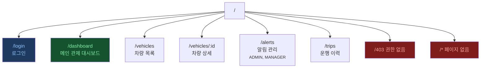
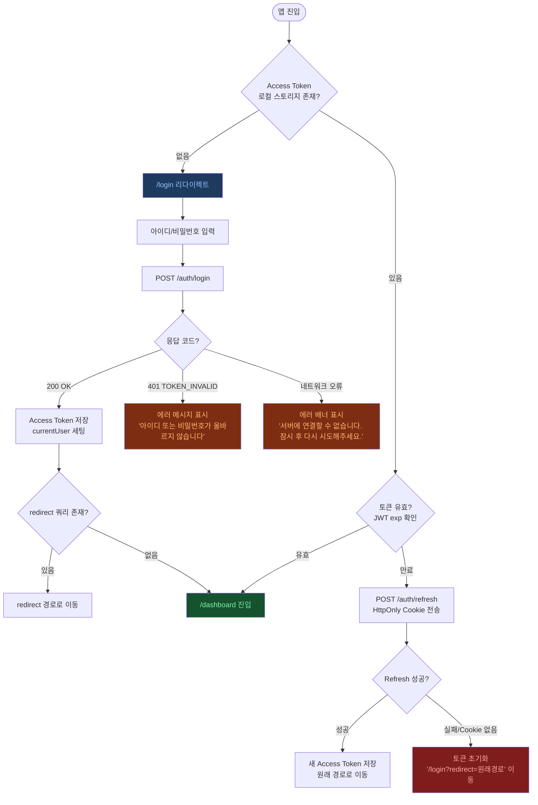
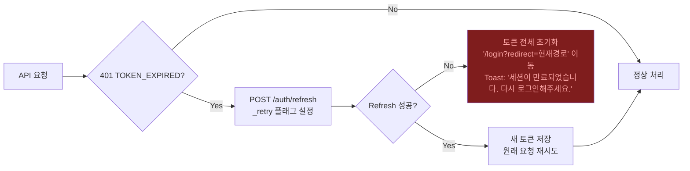

# UX 흐름도 (UX Flow Document)

**프로젝트**: 지능형 오토바이 FMS  
**버전**: v1.0 | **작성일**: 2026-04-13  
**대상**: 프론트엔드 개발자, UI/UX 디자이너

---

## 1. 전체 페이지 구조 (Site Map)



---

## 2. 플로우 1: 인증 흐름 (Login / Token Lifecycle)



---

## 3. 플로우 2: 관제 대시보드 → 차량 선택 → 상세 조회

```mermaid
flowchart TD
    A([/dashboard 진입]) --> B[useFleetStore.fetchVehicles 호출]
    B --> C{API 응답}

    C -- 로딩 중 --> D[차량 목록 영역<br/>스켈레톤 UI 표시<br/><small>LoadingSpinner, 3개 스켈레톤 카드</small>]
    C -- 200 성공 --> E[차량 목록 렌더링<br/>FleetMap에 마커 표출]
    C -- 500 서버 오류 --> ERR1[ErrorState 컴포넌트 표시<br/>'데이터를 불러올 수 없습니다.'<br/>[재시도] 버튼 제공]
    C -- 빈 목록 --> EMPTY1[EmptyState 컴포넌트 표시<br/>'등록된 차량이 없습니다.'<br/><small>ADMIN: [차량 등록] 버튼 표시</small>]

    E --> F[WebSocket 연결 초기화<br/>useRealtimeStore.connect<br/>vehicleIds 전체 구독]
    F --> G{WS 연결 성공?}
    G -- 실패 --> WARN1[상단 경고 배너<br/>'실시간 연결이 끊겼습니다. 재연결 중...']
    G -- 성공 --> H[실시간 위치 업데이트 수신 시작<br/>VEHICLE_LOCATION_UPDATE 이벤트]

    H --> I([사용자가 차량 카드 클릭<br/>또는 지도 마커 클릭])
    I --> J[useFleetStore.selectVehicle 호출<br/>GET /vehicles/:id]
    J --> K{API 응답}

    K -- 로딩 중 --> L[우측 패널 스켈레톤 표시]
    K -- 200 성공 --> M[VehicleStatusPanel 표시<br/>위치, 속도, 배터리, 엔진 온도]
    K -- 404 --> N[패널에 'Not Found' 메시지<br/>'차량 정보를 찾을 수 없습니다.']
    K -- 403 --> O['/403' 리다이렉트]

    M --> P{실시간 알림 수신?<br/>ALERT_OVERSPEED /<br/>ALERT_BATTERY_REPLACE}
    P -- CRITICAL --> Q[AlertBanner 슬라이드인<br/>빨간 배경, 사운드 알림<br/>차량 마커 빨간색 전환]
    P -- WARNING --> R[AlertBanner 슬라이드인<br/>노란 배경<br/>차량 마커 노란색 전환]

    style ERR1 fill:#7f1d1d,color:#fca5a5
    style EMPTY1 fill:#1e293b,color:#94a3b8
    style WARN1 fill:#78350f,color:#fde68a
    style Q fill:#7f1d1d,color:#fca5a5
    style R fill:#78350f,color:#fde68a
```

---

## 4. 플로우 3: 차량 상세 → 운행 이력 조회

```mermaid
flowchart TD
    A([VehicleDetailView 진입<br/>/vehicles/:id]) --> B[GET /vehicles/:id]
    B --> C{응답}
    C -- 200 --> D[차량 기본 정보 렌더링]
    C -- 404 --> Z1([NotFoundView 표시])
    C -- 403 --> Z2([ForbiddenView 표시])

    D --> E[운행 이력 탭 클릭]
    E --> F[날짜 범위 선택<br/>DateRangePicker<br/><small>기본: 최근 7일</small>]
    F --> G[GET /vehicles/:id/trips<br/>startDate, endDate, page=1]
    G --> H{응답}

    H -- 로딩 중 --> I[테이블 스켈레톤 표시<br/>5행 플레이스홀더]
    H -- 200, 데이터 있음 --> J[운행 이력 테이블 렌더링<br/>+ 요약 통계 카드]
    H -- 200, 빈 배열 --> K[EmptyState<br/>'해당 기간에 운행 이력이 없습니다.']
    H -- 422 날짜 범위 초과 --> L[인라인 에러 메시지<br/>'최대 90일 범위까지 조회 가능합니다.']
    H -- 500 --> M[ErrorState + [재시도] 버튼]

    J --> N([운행 행 클릭])
    N --> O[GET /vehicles/:id/sensor-data<br/>trip의 start/end time으로 필터]
    O --> P{응답}
    P -- 200 --> Q[TripRouteMap에 경로 폴리라인 렌더링<br/>SensorChart에 속도/SOC 시계열 표시]
    P -- 200, 커서 페이징 'has_next: true' --> R[더보기 버튼 표시<br/>클릭 시 cursor로 추가 요청]
    P -- 500 --> S[차트 영역 ErrorState 표시]

    style Z1 fill:#7f1d1d,color:#fca5a5
    style Z2 fill:#7f1d1d,color:#fca5a5
    style K fill:#1e293b,color:#94a3b8
    style L fill:#78350f,color:#fde68a
    style M fill:#7f1d1d,color:#fca5a5
    style S fill:#7f1d1d,color:#fca5a5
```

---

## 5. 플로우 4: 배터리 교체 권고 → 충전소 안내 (모바일 앱)

```mermaid
flowchart TD
    A([배터리 교체 알림 수신<br/>FCM Push 알림]) --> B{앱 상태?}

    B -- 포그라운드 --> C[AlertBanner 표시<br/>WebSocket ALERT_BATTERY_REPLACE]
    B -- 백그라운드/종료 --> D[OS Push 알림 표시<br/>'배터리 교체 권고 - 잔량 18%']

    C --> E([배너 탭])
    D --> F([알림 탭 → 딥링크 실행<br/>bikefms://charging-station/nearest])

    E --> G
    F --> G[충전소 탐색 화면 진입<br/>GET /charging-stations?lat=...&radius=3000]

    G --> H{API 응답}
    H -- 로딩 중 --> I[충전소 목록 스켈레톤]
    H -- 200, 목록 있음 --> J[충전소 목록 표시<br/>거리순 정렬, 잔여 슬롯 뱃지]
    H -- 200, 빈 목록 --> K[EmptyState<br/>'반경 3km 내 이용 가능한 충전소가 없습니다.'<br/>[반경 넓히기 +2km] 버튼]
    H -- 네트워크 오류 --> L[ErrorState<br/>'충전소 정보를 불러올 수 없습니다.'<br/>[재시도] 버튼]

    J --> M([충전소 선택])
    K --> N([반경 넓히기 탭])
    N --> G

    M --> O[충전소 상세 표시<br/>이름, 주소, 슬롯 수, 지도 미니뷰]
    O --> P([네비게이션 연동 버튼 탭])

    P --> Q{설치된 앱 선택<br/>카카오맵 / T맵 / 구글맵}
    Q --> R[외부 네비게이션 앱 실행<br/>목적지: 충전소 좌표]
    R --> S[PATCH /alerts/:id/acknowledge<br/>{ driverAction: 'NAVIGATING' }]
    S --> T[알림 상태 '이동 중' 업데이트<br/>관제 대시보드에 WebSocket 전파]

    style K fill:#1e293b,color:#94a3b8
    style L fill:#7f1d1d,color:#fca5a5
    style T fill:#14532d,color:#86efac
```

---

## 6. 플로우 5: 운행 이력 조회 (`/trips`)

```mermaid
flowchart TD
    A([/trips 진입]) --> B[날짜 범위 선택<br/>DateRangePicker<br/><small>기본: 최근 7일, 최대 90일</small>]
    B --> C[차량 선택 (선택적)<br/>드롭다운 또는 전체]

    C --> D[GET /vehicles/:id/trips 또는<br/>GET /trips?driver_id=나의ID<br/>startDate, endDate, page=1]

    D --> E{API 응답}
    E -- 로딩 중 --> F[테이블 스켈레톤 5행]
    E -- 200, 데이터 있음 --> G[운행 목록 테이블 렌더링<br/>+ 요약 통계 카드<br/><small>총 거리, 총 시간, 평균 속도, 알림 수</small>]
    E -- 200, 빈 배열 --> H[EmptyState<br/>'해당 기간에 운행 이력이 없습니다.'<br/>[날짜 변경] 버튼]
    E -- 422 날짜 범위 초과 --> I[인라인 에러<br/>'최대 90일 범위까지 조회 가능합니다.']
    E -- 500 --> J[ErrorState + [재시도] 버튼]

    G --> K([페이지 이동<br/>has_next: true])
    K --> L[다음 페이지 로드<br/>page + 1]
    L --> E

    G --> M([운행 행 클릭])
    M --> N[운행 상세 모달 or 섹션 확장<br/>TripRouteMap + SensorChart]
    N --> O[GET /vehicles/:id/sensor-data<br/>start_time=trip.started_at<br/>end_time=trip.ended_at<br/>limit=200]

    O --> P{응답}
    P -- 200 --> Q[지도에 GPS 경로 폴리라인 렌더링<br/>차트에 속도/SOC 시계열 표시<br/>알림 마커 오버레이]
    P -- has_next: true --> R[더보기 로드<br/>cursor 기반 추가 요청]
    P -- 500 --> S[차트/지도 영역 ErrorState]

    style H fill:#1e293b,color:#94a3b8
    style I fill:#78350f,color:#fde68a
    style J fill:#7f1d1d,color:#fca5a5
    style S fill:#7f1d1d,color:#fca5a5
```

---

## 7. 플로우 6: 알림 관리

```mermaid
flowchart TD
    A([/alerts 진입]) --> B{사용자 역할 확인}
    B -- DRIVER --> Z1(['/403' 리다이렉트])
    B -- ADMIN / MANAGER --> C[useAlertStore.fetchAlerts 호출<br/>cursor 기반 첫 페이지 로드]

    C --> D{응답}
    D -- 로딩 중 --> E[스켈레톤 5행 표시]
    D -- "200 items.length > 0" --> F[알림 목록 렌더링<br/>type, severity, 차량, 운전자, 시각]
    D -- "200 items.length === 0" --> G[EmptyState<br/>'미처리 알림이 없습니다.'<br/><small>빈 배열도 200 OK — 프론트에서 분기</small>]
    D -- 500 --> H[ErrorState + [재시도] 버튼]

    F --> I([필터 적용<br/>type, severity, is_resolved, 날짜])
    I --> J[fetchAlerts reset=true<br/>cursor 초기화 후 재조회]

    F --> K([알림 행 클릭])
    K --> L[AlertDetailModal 열기<br/>payload JSON, 차량 위치 미니맵]

    L --> M{처리 버튼 클릭?}
    M -- 아니오 --> N([모달 닫기])
    M -- 예 --> O[PATCH /alerts/:id/resolve]
    O --> P{응답}
    P -- 200 --> Q[알림 목록에서 is_resolved: true 업데이트<br/>unresolvedCount 감소<br/>모달 닫기 + 성공 Toast]
    P -- 409 이미 처리됨 --> R[Toast 경고<br/>'이미 처리된 알림입니다.']
    P -- 500 --> S[Toast 에러<br/>'처리 중 오류가 발생했습니다.']

    F --> T([스크롤 하단 도달 + has_next: true])
    T --> U[fetchAlerts reset=false<br/>next_cursor로 추가 페이지 로드]
    U --> V[기존 목록 하단에 append]

    style Z1 fill:#7f1d1d,color:#fca5a5
    style G fill:#1e293b,color:#94a3b8
    style H fill:#7f1d1d,color:#fca5a5
    style Q fill:#14532d,color:#86efac
    style R fill:#78350f,color:#fde68a
    style S fill:#7f1d1d,color:#fca5a5
```

---

## 9. 예외 처리 흐름 종합 가이드

### 9.1 API 응답 지연 (Loading State)

**300ms 임계값 구현**: 즉시 스켈레톤을 표시하면 빠른 응답 시 UI가 순간 깜빡입니다.  
`watchEffect` + `setTimeout`으로 300ms 이후에만 로딩 UI를 노출합니다.

```typescript
// src/composables/useDelayedLoading.ts
import { ref, watch } from "vue"

export function useDelayedLoading(source: () => boolean, delay = 300) {
  const showLoading = ref(false)
  let timer: ReturnType<typeof setTimeout> | null = null

  watch(source, (loading) => {
    if (loading) {
      timer = setTimeout(() => { showLoading.value = true }, delay)
    } else {
      if (timer) clearTimeout(timer)
      showLoading.value = false
    }
  }, { immediate: true })

  return { showLoading }
}

// 사용 예:
// const { showLoading } = useDelayedLoading(() => fleetStore.isLoading)
// <SkeletonCard v-if="showLoading" />
// <VehicleList v-else-if="!fleetStore.error" />
```

| 컨텍스트 | 로딩 UI | 구현 |
|---|---|---|
| 전체 페이지 초기 로드 | 스켈레톤 카드 (3~5개) | `useDelayedLoading` + Skeleton 컴포넌트 |
| 버튼 액션 (저장, 처리) | 버튼 내 스피너 + disabled | `:loading="isSubmitting"` → BaseButton |
| 배경 갱신 (필터 변경) | 목록 위 반투명 오버레이 | `opacity-50 pointer-events-none` |
| 무한 스크롤 추가 로드 | 하단 로딩 스피너 | `IntersectionObserver` 트리거 |

---

### 9.2 토큰 만료 (TOKEN_EXPIRED)



**구현 위치**: `src/services/http.ts` Axios Response 인터셉터  
**자동화**: 사용자 개입 없이 토큰 갱신 후 원래 요청 투명 재시도

---

### 9.3 권한 없음 (403 PERMISSION_DENIED)

| 발생 시점 | 처리 방식 | UI 표현 |
|---|---|---|
| **라우터 진입 시** (roleGuard) | `/403` 리다이렉트 | ForbiddenView 전체 화면 |
| **API 호출 중** 권한 오류 | 현재 페이지 유지 | 인라인 ErrorState 또는 Toast 에러 |
| **버튼/액션 비노출** | 역할 기반 `v-if` | 버튼 자체를 DOM에서 제거 |

```vue
<!-- 역할 기반 UI 조건부 렌더링 -->
<BaseButton
  v-if="authStore.isManager"
  @click="resolveAlert"
>
  처리 완료
</BaseButton>
```

---

### 9.4 데이터 없음 (Empty State)

모든 목록/조회 화면은 빈 데이터를 별도 컴포넌트로 처리합니다.

```
EmptyState 컴포넌트 Props:
  - icon     : Heroicon 컴포넌트
  - title    : 메인 메시지 (예: "등록된 차량이 없습니다.")
  - subtitle : 보조 메시지 (예: "차량을 등록하여 관제를 시작하세요.")
  - action?  : { label, onClick } — 액션 버튼 (역할에 따라 조건부)
```

| 화면 | 빈 상태 메시지 | 액션 버튼 |
|---|---|---|
| 차량 목록 | "등록된 차량이 없습니다." | [차량 등록] (ADMIN/MANAGER) |
| 알림 목록 | "미처리 알림이 없습니다." | 없음 |
| 운행 이력 | "해당 기간에 운행 이력이 없습니다." | [날짜 변경] |
| 검색 결과 | "'홍길동'에 대한 결과가 없습니다." | [검색어 지우기] |

---

### 9.5 네트워크/서버 오류 (5xx / Network Error)

```
ErrorState 컴포넌트 Props:
  - message  : 사용자용 에러 메시지
  - onRetry? : 재시도 콜백 함수
```

| 오류 유형 | 사용자 메시지 | 처리 방식 |
|---|---|---|
| `Network Error` (연결 불가) | "서버에 연결할 수 없습니다." | 인라인 ErrorState + [재시도] |
| `500 INTERNAL_ERROR` | "데이터를 불러올 수 없습니다." | 인라인 ErrorState + [재시도] |
| `408 Timeout` | "요청 시간이 초과되었습니다." | Toast 에러 |
| `429 RATE_LIMITED` | "잠시 후 다시 시도해주세요." | Toast 경고 + 버튼 일시 비활성화 |

---

### 9.6 WebSocket 연결 이상

```mermaid
flowchart TD
    A[WS 연결 시도] --> B{연결 성공?}
    B -- 성공 --> C[정상 실시간 수신]
    B -- 실패 --> D[상단 노란 배너 표시<br/>'실시간 연결이 끊겼습니다. 재연결 중...']
    D --> E[Socket.IO 자동 재연결<br/>2초 간격, 최대 10회]
    E --> F{재연결 성공?}
    F -- 성공 --> G[배너 숨김<br/>Toast: '실시간 연결이 복구되었습니다.']
    G --> C
    F -- 10회 모두 실패 --> H[배너 업데이트<br/>'실시간 연결을 복구할 수 없습니다.<br/>페이지를 새로고침해주세요.'<br/>[새로고침] 버튼]

    style D fill:#78350f,color:#fde68a
    style G fill:#14532d,color:#86efac
    style H fill:#7f1d1d,color:#fca5a5
```

---

## 10. Toast 알림 시스템

```typescript
// useToast composable 사용 규약
const toast = useToast()

toast.success("알림이 처리되었습니다.")           // 초록, 3초 자동 닫힘
toast.warning("배터리 잔량이 20% 미만입니다.")    // 노랑, 5초 자동 닫힘
toast.error("서버 오류가 발생했습니다.")           // 빨강, 7초 또는 수동 닫힘
toast.info("새 운행이 시작되었습니다.")            // 파랑, 3초 자동 닫힘
```

| 타입 | 색상 | 자동 닫힘 | 위치 |
|---|---|---|---|
| `success` | success-500 | 3초 | 우측 하단 |
| `info` | info-500 | 3초 | 우측 하단 |
| `warning` | warning-500 | 5초 | 우측 하단 |
| `error` | danger-500 | 7초 (수동 닫기 가능) | 우측 하단 |

---

## 11. 전역 예외 처리 매트릭스

| HTTP 코드 | error.code | 처리 방식 | 사용자 메시지 |
|---|---|---|---|
| 400 | `VALIDATION_ERROR` | 인라인 폼 에러 | 필드별 메시지 표시 |
| 401 | `TOKEN_EXPIRED` | 자동 갱신 → 재시도 | (사용자 개입 없음) |
| 401 | `TOKEN_INVALID` | `/login` 리다이렉트 | "세션이 만료되었습니다." |
| 403 | `PERMISSION_DENIED` | `/403` 또는 Toast | "이 작업을 수행할 권한이 없습니다." |
| 404 | `NOT_FOUND` | `/404` 또는 인라인 | "요청한 정보를 찾을 수 없습니다." |
| 409 | `CONFLICT` | Toast warning | "이미 존재하는 데이터입니다." |
| 422 | `UNPROCESSABLE` | 인라인 에러 | 서버 반환 메시지 |
| 429 | `RATE_LIMITED` | Toast warning + throttle | "잠시 후 다시 시도해주세요." |
| 500 | `INTERNAL_ERROR` | ErrorState + 재시도 | "서버 오류가 발생했습니다." |
| Network | — | Toast error | "서버에 연결할 수 없습니다." |
