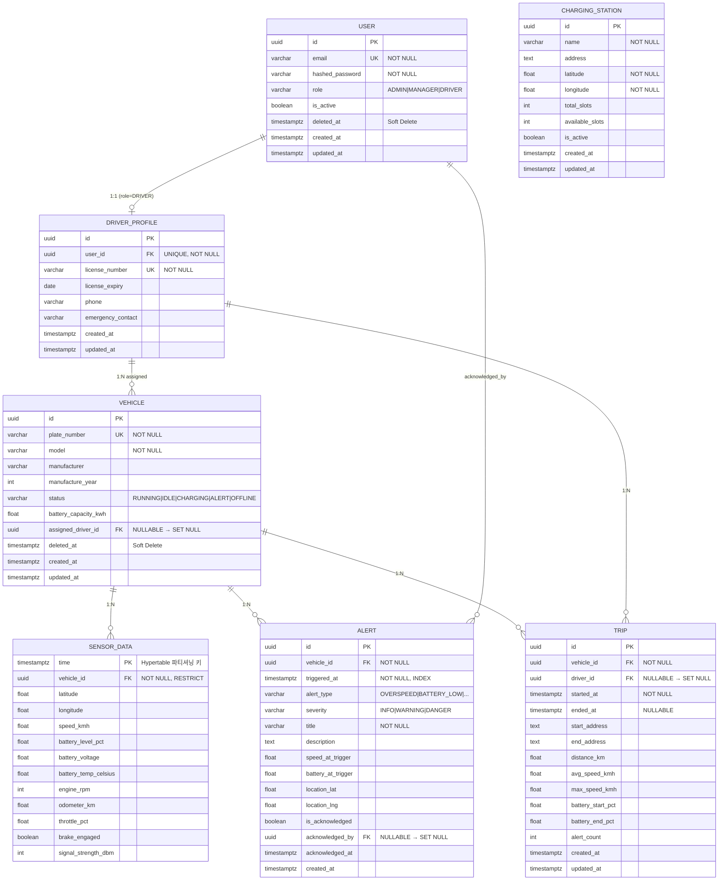

# 13. Database Model — SQLModel 기반 데이터베이스 설계 명세서

> **스택**: Python 3.11 · SQLModel 0.0.21 · SQLAlchemy 2.x · PostgreSQL 15 + TimescaleDB  
> **원칙**: UUID 기본키, UTC 타임스탬프, Soft Delete(마스터 데이터), TimescaleDB Hypertable(센서 데이터)

---

## 목차

1. [전체 ER 다이어그램](#1-전체-er-다이어그램)
2. [공통 기반 — Base Mixin](#2-공통-기반--base-mixin)
3. [Master Data 테이블](#3-master-data-테이블)
   - 3.1 User
   - 3.2 DriverProfile
   - 3.3 Vehicle
   - 3.4 ChargingStation
4. [Transaction Data 테이블](#4-transaction-data-테이블)
   - 4.1 SensorData
   - 4.2 Alert
   - 4.3 Trip
5. [테이블 간 관계 및 Cascade 정책](#5-테이블-간-관계-및-cascade-정책)
6. [성능 최적화 전략](#6-성능-최적화-전략)
7. [초기화 스크립트 — create_tables.py](#7-초기화-스크립트)

---

## 1. 전체 ER 다이어그램



---

## 2. 공통 기반 — Base Mixin

모든 테이블이 공유하는 UUID 기본키와 타임스탬프를 Mixin으로 분리합니다.

> **핵심**: SQLModel Mixin은 `table=True`를 선언하지 않습니다. `table=True`는 실제 테이블을 생성하는 모델에만 사용합니다.

```python
# chalicelib/models/base.py
from __future__ import annotations

import uuid
from datetime import datetime, timezone
from typing import Optional

from sqlalchemy import Column, DateTime
from sqlmodel import Field, SQLModel


def utcnow() -> datetime:
    """항상 timezone-aware UTC datetime을 반환합니다."""
    return datetime.now(timezone.utc)


class UUIDMixin(SQLModel):
    """UUID 기본키 Mixin — table=True 없이 상속만 받아 사용합니다."""

    id: uuid.UUID = Field(
        default_factory=uuid.uuid4,
        primary_key=True,
        sa_column_kwargs={"comment": "기본키 (UUID v4)"},
    )


class TimestampMixin(SQLModel):
    """created_at / updated_at 자동 관리 Mixin.

    - created_at: 레코드 최초 생성 시 자동 기록 (DB 레벨 default)
    - updated_at: UPDATE 발생 시 SQLAlchemy onupdate 트리거로 자동 갱신
    """

    created_at: datetime = Field(
        default_factory=utcnow,
        sa_column=Column(
            DateTime(timezone=True),
            nullable=False,
            default=utcnow,
            comment="생성 일시 (UTC)",
        ),
    )
    updated_at: datetime = Field(
        default_factory=utcnow,
        sa_column=Column(
            DateTime(timezone=True),
            nullable=False,
            default=utcnow,
            onupdate=utcnow,          # ← SQLAlchemy 레벨 자동 갱신 (중요)
            comment="최종 수정 일시 (UTC)",
        ),
    )


class SoftDeleteMixin(SQLModel):
    """Soft Delete Mixin.

    deleted_at 이 None → 유효한 레코드
    deleted_at 에 값   → 삭제된 레코드 (물리 삭제 X)

    Repository 레이어에서 WHERE deleted_at IS NULL 조건을 항상 적용해야 합니다.
    """

    deleted_at: Optional[datetime] = Field(
        default=None,
        sa_column=Column(
            DateTime(timezone=True),
            nullable=True,
            index=True,               # ← 삭제 여부 필터링 쿼리 최적화
            comment="소프트 삭제 일시 (NULL=유효)",
        ),
    )
```

---

## 3. Master Data 테이블

### 3.1 User — 사용자 (관리자 / 매니저 / 기사)

```python
# chalicelib/models/user.py
from __future__ import annotations

import uuid
from enum import Enum
from typing import TYPE_CHECKING, List, Optional

from sqlalchemy import Column, String, UniqueConstraint
from sqlmodel import Field, Relationship, SQLModel

from .base import SoftDeleteMixin, TimestampMixin, UUIDMixin

if TYPE_CHECKING:
    from .alert import Alert
    from .driver_profile import DriverProfile


class UserRole(str, Enum):
    ADMIN   = "ADMIN"    # 시스템 전체 관리자
    MANAGER = "MANAGER"  # 운영 매니저 (차량 배차, 알림 조회)
    DRIVER  = "DRIVER"   # 배달 기사 (본인 차량 정보만 접근)


class User(UUIDMixin, TimestampMixin, SoftDeleteMixin, table=True):
    """사용자 테이블.

    관리자·매니저는 DriverProfile이 없고, DRIVER 역할 사용자만 DriverProfile을 가집니다.
    비밀번호는 bcrypt 해시로만 저장합니다 (평문 절대 금지).
    """

    __tablename__ = "users"
    __table_args__ = (
        UniqueConstraint("email", name="uq_users_email"),
        {"comment": "시스템 사용자 (관리자/매니저/기사)"},
    )

    email: str = Field(
        sa_column=Column(String(255), nullable=False, index=True),
        description="로그인 이메일 (고유)",
    )
    hashed_password: str = Field(
        sa_column=Column(String(255), nullable=False),
        description="bcrypt 해시 비밀번호",
    )
    full_name: str = Field(
        sa_column=Column(String(100), nullable=False),
        description="사용자 실명",
    )
    role: UserRole = Field(
        default=UserRole.DRIVER,
        sa_column=Column(String(20), nullable=False, index=True),
        description="권한 역할",
    )
    is_active: bool = Field(
        default=True,
        description="계정 활성화 여부 (False = 정지 계정)",
    )

    # ── Relationships ─────────────────────────────────────────
    # User 1 ─── 1 DriverProfile  (role=DRIVER인 경우에만 존재)
    driver_profile: Optional["DriverProfile"] = Relationship(
        back_populates="user",
        sa_relationship_kwargs={"uselist": False},
    )
    # User 1 ─── N Alert  (acknowledged_by 역방향)
    acknowledged_alerts: List["Alert"] = Relationship(
        back_populates="acknowledger",
        sa_relationship_kwargs={
            "foreign_keys": "[Alert.acknowledged_by_id]",
            "lazy": "select",
        },
    )
```

---

### 3.2 DriverProfile — 운전자 프로필

```python
# chalicelib/models/driver_profile.py
from __future__ import annotations

import uuid
from datetime import date
from typing import TYPE_CHECKING, List, Optional

from sqlalchemy import Column, Date, ForeignKey, String, UniqueConstraint
from sqlmodel import Field, Relationship, SQLModel

from .base import TimestampMixin, UUIDMixin

if TYPE_CHECKING:
    from .trip import Trip
    from .user import User
    from .vehicle import Vehicle


class DriverProfile(UUIDMixin, TimestampMixin, table=True):
    """운전자 세부 프로필.

    User(role=DRIVER) 와 1:1 관계입니다.
    User 삭제 시 CASCADE DELETE 처리됩니다 (User의 Soft Delete가 발생해도 물리 행은 유지).
    단, User 물리 삭제(admin 정리 배치) 시에만 Cascade가 실제로 작동합니다.
    """

    __tablename__ = "driver_profiles"
    __table_args__ = (
        UniqueConstraint("user_id", name="uq_driver_profiles_user_id"),
        UniqueConstraint("license_number", name="uq_driver_profiles_license"),
        {"comment": "운전자 면허 및 연락처 정보"},
    )

    user_id: uuid.UUID = Field(
        sa_column=Column(
            ForeignKey("users.id", ondelete="CASCADE"),  # User 물리 삭제 시 함께 삭제
            nullable=False,
            unique=True,
        ),
        description="연결된 User ID",
    )
    license_number: str = Field(
        sa_column=Column(String(30), nullable=False),
        description="운전면허 번호",
    )
    license_expiry: date = Field(
        sa_column=Column(Date, nullable=False),
        description="운전면허 만료일",
    )
    phone: str = Field(
        sa_column=Column(String(20), nullable=False),
        description="연락처",
    )
    emergency_contact: Optional[str] = Field(
        default=None,
        sa_column=Column(String(20), nullable=True),
        description="비상 연락처",
    )

    # ── Relationships ─────────────────────────────────────────
    user: Optional["User"] = Relationship(back_populates="driver_profile")

    # DriverProfile 1 ─── N Vehicle  (배차 관계)
    assigned_vehicles: List["Vehicle"] = Relationship(
        back_populates="assigned_driver",
        sa_relationship_kwargs={
            "foreign_keys": "[Vehicle.assigned_driver_id]",
        },
    )
    # DriverProfile 1 ─── N Trip
    trips: List["Trip"] = Relationship(back_populates="driver")
```

---

### 3.3 Vehicle — 차량

```python
# chalicelib/models/vehicle.py
from __future__ import annotations

import uuid
from enum import Enum
from typing import TYPE_CHECKING, List, Optional

from sqlalchemy import Column, Float, ForeignKey, Integer, String
from sqlmodel import Field, Relationship, SQLModel

from .base import SoftDeleteMixin, TimestampMixin, UUIDMixin

if TYPE_CHECKING:
    from .alert import Alert
    from .driver_profile import DriverProfile
    from .sensor_data import SensorData
    from .trip import Trip


class VehicleStatus(str, Enum):
    RUNNING  = "RUNNING"   # 운행 중
    IDLE     = "IDLE"      # 정차
    CHARGING = "CHARGING"  # 충전 중
    ALERT    = "ALERT"     # 경고 상태
    OFFLINE  = "OFFLINE"   # 통신 두절


class Vehicle(UUIDMixin, TimestampMixin, SoftDeleteMixin, table=True):
    """차량 마스터 테이블.

    Soft Delete 적용: deleted_at에 값이 있으면 폐차/매각 처리된 차량입니다.
    삭제 정책:
      - SensorData → RESTRICT  (데이터가 남아있으면 Vehicle 삭제 불가)
      - Alert      → RESTRICT
      - Trip       → RESTRICT
    운영상 차량을 Soft Delete 한 후, 관련 데이터는 별도 아카이브 배치로 처리합니다.
    """

    __tablename__ = "vehicles"
    __table_args__ = {"comment": "등록 차량 정보"}

    plate_number: str = Field(
        sa_column=Column(String(20), nullable=False, unique=True, index=True),
        description="차량 번호판 (고유)",
    )
    model: str = Field(
        sa_column=Column(String(100), nullable=False),
        description="차량 모델명 (예: PCX Electric)",
    )
    manufacturer: str = Field(
        sa_column=Column(String(50), nullable=False),
        description="제조사 (예: Honda)",
    )
    manufacture_year: int = Field(
        sa_column=Column(Integer, nullable=False),
        description="제조 연도",
    )
    status: VehicleStatus = Field(
        default=VehicleStatus.OFFLINE,
        sa_column=Column(String(20), nullable=False, index=True),
        description="현재 차량 상태",
    )
    battery_capacity_kwh: float = Field(
        sa_column=Column(Float, nullable=False),
        description="배터리 총 용량 (kWh)",
    )
    vin: Optional[str] = Field(
        default=None,
        sa_column=Column(String(17), nullable=True, unique=True),
        description="차대 번호 (Vehicle Identification Number)",
    )

    # FK: 현재 배차된 운전자 (없을 수 있음)
    assigned_driver_id: Optional[uuid.UUID] = Field(
        default=None,
        sa_column=Column(
            ForeignKey("driver_profiles.id", ondelete="SET NULL"),
            nullable=True,
            index=True,
        ),
        description="배차된 운전자 프로필 ID (NULL = 미배차)",
    )

    # ── Relationships ─────────────────────────────────────────
    assigned_driver: Optional["DriverProfile"] = Relationship(
        back_populates="assigned_vehicles",
        sa_relationship_kwargs={
            "foreign_keys": "[Vehicle.assigned_driver_id]",
        },
    )
    sensor_data: List["SensorData"] = Relationship(back_populates="vehicle")
    alerts: List["Alert"] = Relationship(back_populates="vehicle")
    trips: List["Trip"] = Relationship(back_populates="vehicle")
```

---

### 3.4 ChargingStation — 충전소

```python
# chalicelib/models/charging_station.py
from __future__ import annotations

from sqlalchemy import Column, Boolean, Float, Integer, String
from sqlmodel import Field, SQLModel

from .base import TimestampMixin, UUIDMixin


class ChargingStation(UUIDMixin, TimestampMixin, table=True):
    """충전소 정보 테이블.

    차량과 직접적인 FK 관계는 없습니다.
    기사 앱의 "충전소 찾기" 기능에서 위경도 기반 반경 검색(PostGIS 또는 수식)에 사용됩니다.
    """

    __tablename__ = "charging_stations"
    __table_args__ = {"comment": "충전소 위치 및 슬롯 정보"}

    name: str = Field(
        sa_column=Column(String(100), nullable=False),
        description="충전소 명칭",
    )
    address: str = Field(
        sa_column=Column(String(255), nullable=False),
        description="도로명 주소",
    )
    latitude: float = Field(
        sa_column=Column(Float, nullable=False, index=True),
        description="위도",
    )
    longitude: float = Field(
        sa_column=Column(Float, nullable=False, index=True),
        description="경도",
    )
    total_slots: int = Field(
        default=1,
        sa_column=Column(Integer, nullable=False),
        description="총 충전 슬롯 수",
    )
    available_slots: int = Field(
        default=0,
        sa_column=Column(Integer, nullable=False),
        description="현재 사용 가능한 슬롯 수",
    )
    operator_name: Optional[str] = Field(
        default=None,
        sa_column=Column(String(100), nullable=True),
        description="운영 업체명",
    )
    contact_phone: Optional[str] = Field(
        default=None,
        sa_column=Column(String(20), nullable=True),
        description="충전소 연락처",
    )
    is_active: bool = Field(
        default=True,
        sa_column=Column(Boolean, nullable=False, index=True),
        description="운영 여부",
    )
```

---

## 4. Transaction Data 테이블

### 4.1 SensorData — IoT 센서 원격측정 데이터 (TimescaleDB Hypertable)

```python
# chalicelib/models/sensor_data.py
from __future__ import annotations

import uuid
from datetime import datetime
from typing import TYPE_CHECKING, Optional

from sqlalchemy import Column, DateTime, Float, ForeignKey, Index, Integer, Boolean
from sqlmodel import Field, Relationship, SQLModel

if TYPE_CHECKING:
    from .vehicle import Vehicle


class SensorData(SQLModel, table=True):
    """IoT 센서 원격측정 데이터 테이블.

    ⚠️  이 테이블은 TimescaleDB Hypertable로 변환됩니다.
        create_hypertable('sensor_data', 'time') 실행 후에는
        time 컬럼이 복합 Primary Key의 일부가 됩니다.

    PK 구성: (time, vehicle_id)
        - time 단독 PK로는 같은 시각 다중 차량 데이터 충돌 발생
        - vehicle_id 포함 복합 PK로 TimescaleDB 청크 내 고유성 보장

    데이터 규모 추정:
        - 차량 1대 × 1초 간격 × 86,400초 = 86,400 rows/일/대
        - 차량 100대 기준 약 864만 rows/일
        - 30일 = 약 2억 5,920만 rows
    """

    __tablename__ = "sensor_data"
    __table_args__ = (
        # 복합 인덱스: vehicle_id + time 역순 (최신 데이터 조회 최적화)
        Index("idx_sensor_data_vehicle_time", "vehicle_id", "time", postgresql_desc_columns=["time"]),
        # TimescaleDB가 자동으로 time 기반 청크 인덱스를 생성하지만,
        # vehicle_id 필터링이 항상 동반되므로 복합 인덱스가 더 효율적입니다.
        {"comment": "IoT 센서 시계열 데이터 (TimescaleDB Hypertable)"},
    )

    # ── Primary Key (복합) ──────────────────────────────────────
    time: datetime = Field(
        sa_column=Column(
            DateTime(timezone=True),
            nullable=False,
            primary_key=True,
            comment="측정 시각 (UTC) — Hypertable 파티셔닝 기준",
        ),
    )
    vehicle_id: uuid.UUID = Field(
        sa_column=Column(
            ForeignKey("vehicles.id", ondelete="RESTRICT"),  # 센서 데이터 보존 원칙
            nullable=False,
            primary_key=True,
        ),
        description="센서 데이터를 발생시킨 차량 ID",
    )

    # ── GPS 데이터 ────────────────────────────────────────────
    latitude: Optional[float] = Field(
        default=None,
        sa_column=Column(Float, nullable=True),
        description="위도 (°, WGS84)",
    )
    longitude: Optional[float] = Field(
        default=None,
        sa_column=Column(Float, nullable=True),
        description="경도 (°, WGS84)",
    )
    altitude_m: Optional[float] = Field(
        default=None,
        sa_column=Column(Float, nullable=True),
        description="해발 고도 (m)",
    )
    heading_deg: Optional[float] = Field(
        default=None,
        sa_column=Column(Float, nullable=True),
        description="진행 방향 (°, 0=북, 90=동)",
    )

    # ── 주행 데이터 (OBD) ─────────────────────────────────────
    speed_kmh: Optional[float] = Field(
        default=None,
        sa_column=Column(Float, nullable=True),
        description="현재 속도 (km/h)",
    )
    engine_rpm: Optional[int] = Field(
        default=None,
        sa_column=Column(Integer, nullable=True),
        description="엔진 RPM",
    )
    odometer_km: Optional[float] = Field(
        default=None,
        sa_column=Column(Float, nullable=True),
        description="누적 주행 거리 (km)",
    )
    throttle_pct: Optional[float] = Field(
        default=None,
        sa_column=Column(Float, nullable=True),
        description="스로틀 개도율 (%)",
    )
    brake_engaged: Optional[bool] = Field(
        default=None,
        sa_column=Column(Boolean, nullable=True),
        description="브레이크 작동 여부",
    )

    # ── 배터리 데이터 (BMS) ───────────────────────────────────
    battery_level_pct: Optional[float] = Field(
        default=None,
        sa_column=Column(Float, nullable=True),
        description="배터리 잔량 (%)",
    )
    battery_voltage_v: Optional[float] = Field(
        default=None,
        sa_column=Column(Float, nullable=True),
        description="배터리 전압 (V)",
    )
    battery_current_a: Optional[float] = Field(
        default=None,
        sa_column=Column(Float, nullable=True),
        description="배터리 전류 (A, 양수=방전, 음수=충전)",
    )
    battery_temp_celsius: Optional[float] = Field(
        default=None,
        sa_column=Column(Float, nullable=True),
        description="배터리 셀 온도 (°C)",
    )

    # ── 통신 품질 ─────────────────────────────────────────────
    signal_strength_dbm: Optional[int] = Field(
        default=None,
        sa_column=Column(Integer, nullable=True),
        description="LTE/4G 신호 강도 (dBm)",
    )

    # ── Relationship ──────────────────────────────────────────
    vehicle: Optional["Vehicle"] = Relationship(back_populates="sensor_data")
```

---

### 4.2 Alert — 이벤트 및 경고 내역

```python
# chalicelib/models/alert.py
from __future__ import annotations

import uuid
from datetime import datetime
from enum import Enum
from typing import TYPE_CHECKING, Optional

from sqlalchemy import Boolean, Column, DateTime, Float, ForeignKey, Index, String, Text
from sqlmodel import Field, Relationship, SQLModel

from .base import TimestampMixin, UUIDMixin

if TYPE_CHECKING:
    from .user import User
    from .vehicle import Vehicle


class AlertType(str, Enum):
    OVERSPEED          = "OVERSPEED"           # 과속
    BATTERY_LOW        = "BATTERY_LOW"         # 배터리 부족 (≤30%)
    BATTERY_CRITICAL   = "BATTERY_CRITICAL"    # 배터리 위험 (≤10%)
    GEOFENCE_EXIT      = "GEOFENCE_EXIT"       # 운행 구역 이탈
    SUDDEN_ACCEL       = "SUDDEN_ACCEL"        # 급가속
    SUDDEN_BRAKE       = "SUDDEN_BRAKE"        # 급감속
    ACCIDENT_SUSPECTED = "ACCIDENT_SUSPECTED"  # 사고 의심 (충격 감지)
    MAINTENANCE_DUE    = "MAINTENANCE_DUE"     # 정비 권고
    COMMUNICATION_LOST = "COMMUNICATION_LOST"  # 통신 두절


class AlertSeverity(str, Enum):
    INFO    = "INFO"     # 참고 (파란색)
    WARNING = "WARNING"  # 주의 (노란색)
    DANGER  = "DANGER"   # 위험 (빨간색)


class Alert(UUIDMixin, TimestampMixin, table=True):
    """이벤트 및 경고 내역 테이블.

    Cascade 정책:
        - Vehicle 삭제 → RESTRICT (경고 기록 보존 원칙)
        - acknowledged_by User 삭제 → SET NULL (기록은 유지, 담당자 정보만 해제)
    """

    __tablename__ = "alerts"
    __table_args__ = (
        Index("idx_alerts_vehicle_triggered", "vehicle_id", "triggered_at"),
        Index("idx_alerts_severity_ack", "severity", "is_acknowledged"),
        {"comment": "차량 이벤트 및 경고 내역"},
    )

    # ── 핵심 필드 ─────────────────────────────────────────────
    vehicle_id: uuid.UUID = Field(
        sa_column=Column(
            ForeignKey("vehicles.id", ondelete="RESTRICT"),
            nullable=False,
            index=True,
        ),
    )
    triggered_at: datetime = Field(
        sa_column=Column(
            DateTime(timezone=True),
            nullable=False,
            index=True,
            comment="경고 발생 시각 (UTC)",
        ),
    )
    alert_type: AlertType = Field(
        sa_column=Column(String(30), nullable=False, index=True),
    )
    severity: AlertSeverity = Field(
        sa_column=Column(String(10), nullable=False, index=True),
    )
    title: str = Field(
        sa_column=Column(String(200), nullable=False),
        description="경고 제목 (예: '17호차 과속 감지 — 92km/h')",
    )
    description: Optional[str] = Field(
        default=None,
        sa_column=Column(Text, nullable=True),
        description="경고 상세 설명",
    )

    # ── 발생 시점 컨텍스트 (스냅샷) ──────────────────────────
    # 이 값들은 나중에 SensorData가 삭제/압축되어도 경고 내용 파악이 가능하도록
    # 경고 발생 시점의 값을 비정규화하여 함께 저장합니다.
    speed_at_trigger: Optional[float] = Field(
        default=None,
        sa_column=Column(Float, nullable=True),
        description="경고 발생 시 속도 (km/h)",
    )
    battery_at_trigger: Optional[float] = Field(
        default=None,
        sa_column=Column(Float, nullable=True),
        description="경고 발생 시 배터리 잔량 (%)",
    )
    location_lat: Optional[float] = Field(
        default=None,
        sa_column=Column(Float, nullable=True),
        description="경고 발생 위치 — 위도",
    )
    location_lng: Optional[float] = Field(
        default=None,
        sa_column=Column(Float, nullable=True),
        description="경고 발생 위치 — 경도",
    )

    # ── 처리 상태 ─────────────────────────────────────────────
    is_acknowledged: bool = Field(
        default=False,
        sa_column=Column(Boolean, nullable=False, index=True),
        description="관제사 확인 여부",
    )
    acknowledged_by_id: Optional[uuid.UUID] = Field(
        default=None,
        sa_column=Column(
            ForeignKey("users.id", ondelete="SET NULL"),  # 담당자 퇴사해도 경고 기록 유지
            nullable=True,
        ),
        description="확인한 관제사 User ID",
    )
    acknowledged_at: Optional[datetime] = Field(
        default=None,
        sa_column=Column(DateTime(timezone=True), nullable=True),
        description="확인 처리 일시",
    )

    # ── Relationships ─────────────────────────────────────────
    vehicle: Optional["Vehicle"] = Relationship(back_populates="alerts")
    acknowledger: Optional["User"] = Relationship(
        back_populates="acknowledged_alerts",
        sa_relationship_kwargs={"foreign_keys": "[Alert.acknowledged_by_id]"},
    )
```

---

### 4.3 Trip — 운행 기록 (요약본)

```python
# chalicelib/models/trip.py
from __future__ import annotations

import uuid
from datetime import datetime
from typing import TYPE_CHECKING, Optional

from sqlalchemy import Column, DateTime, Float, ForeignKey, Index, Integer, Text
from sqlmodel import Field, Relationship, SQLModel

from .base import TimestampMixin, UUIDMixin

if TYPE_CHECKING:
    from .driver_profile import DriverProfile
    from .vehicle import Vehicle


class Trip(UUIDMixin, TimestampMixin, table=True):
    """운행 기록 요약 테이블.

    SensorData가 초 단위 원시 데이터라면,
    Trip은 "출발~도착" 한 구간의 요약 통계입니다.
    (총 거리, 평균/최고속도, 배터리 소모량, 발생 알림 수 등)

    Cascade 정책:
        - Vehicle 삭제 → RESTRICT
        - DriverProfile 삭제 → SET NULL (운행 기록은 유지, 기사 정보만 해제)
    """

    __tablename__ = "trips"
    __table_args__ = (
        Index("idx_trips_vehicle_started", "vehicle_id", "started_at"),
        Index("idx_trips_driver_started", "driver_id", "started_at"),
        {"comment": "차량 운행 구간 요약 기록"},
    )

    vehicle_id: uuid.UUID = Field(
        sa_column=Column(
            ForeignKey("vehicles.id", ondelete="RESTRICT"),
            nullable=False,
            index=True,
        ),
    )
    driver_id: Optional[uuid.UUID] = Field(
        default=None,
        sa_column=Column(
            ForeignKey("driver_profiles.id", ondelete="SET NULL"),
            nullable=True,
            index=True,
        ),
        description="운행 기사 ID (미배차 운행 시 NULL 가능)",
    )

    # ── 운행 시간 ─────────────────────────────────────────────
    started_at: datetime = Field(
        sa_column=Column(
            DateTime(timezone=True),
            nullable=False,
            comment="운행 시작 일시 (UTC)",
        ),
    )
    ended_at: Optional[datetime] = Field(
        default=None,
        sa_column=Column(
            DateTime(timezone=True),
            nullable=True,
            comment="운행 종료 일시 (NULL = 운행 중)",
        ),
    )

    # ── 운행 경로 ─────────────────────────────────────────────
    start_address: Optional[str] = Field(
        default=None,
        sa_column=Column(Text, nullable=True),
        description="출발지 주소 (역지오코딩 결과)",
    )
    end_address: Optional[str] = Field(
        default=None,
        sa_column=Column(Text, nullable=True),
        description="도착지 주소",
    )

    # ── 운행 통계 (SensorData 집계값) ────────────────────────
    distance_km: Optional[float] = Field(
        default=None,
        sa_column=Column(Float, nullable=True),
        description="총 운행 거리 (km)",
    )
    avg_speed_kmh: Optional[float] = Field(
        default=None,
        sa_column=Column(Float, nullable=True),
        description="평균 속도 (km/h)",
    )
    max_speed_kmh: Optional[float] = Field(
        default=None,
        sa_column=Column(Float, nullable=True),
        description="최고 속도 (km/h)",
    )
    battery_start_pct: Optional[float] = Field(
        default=None,
        sa_column=Column(Float, nullable=True),
        description="출발 시 배터리 잔량 (%)",
    )
    battery_end_pct: Optional[float] = Field(
        default=None,
        sa_column=Column(Float, nullable=True),
        description="도착 시 배터리 잔량 (%)",
    )
    alert_count: int = Field(
        default=0,
        sa_column=Column(Integer, nullable=False),
        description="운행 중 발생한 알림 수",
    )

    # ── Relationships ─────────────────────────────────────────
    vehicle: Optional["Vehicle"] = Relationship(back_populates="trips")
    driver: Optional["DriverProfile"] = Relationship(back_populates="trips")
```

---

## 5. 테이블 간 관계 및 Cascade 정책

### 5.1 관계 요약표

| 부모 | 자식 | 관계 | ondelete | 이유 |
|---|---|---|---|---|
| `User` | `DriverProfile` | 1:1 | `CASCADE` | 유저 계정이 완전히 삭제되면 프로필도 의미 없음 |
| `DriverProfile` | `Vehicle` (assigned_driver_id) | 1:N | `SET NULL` | 기사가 퇴사해도 차량은 존속, 미배차 상태로 전환 |
| `Vehicle` | `SensorData` | 1:N | `RESTRICT` | 원시 데이터 임의 삭제 방지 (감사·분쟁 증거) |
| `Vehicle` | `Alert` | 1:N | `RESTRICT` | 경고 이력 보존 의무 |
| `Vehicle` | `Trip` | 1:N | `RESTRICT` | 운행 기록 보존 의무 |
| `DriverProfile` | `Trip` (driver_id) | 1:N | `SET NULL` | 기사 정보 삭제 시 운행 기록은 유지 |
| `User` | `Alert` (acknowledged_by_id) | 1:N | `SET NULL` | 관제사 퇴사 시 처리 기록 보존 |

### 5.2 Soft Delete 대상 테이블

| 테이블 | Soft Delete 적용 | 이유 |
|---|---|---|
| `User` | ✅ `deleted_at` | 계정 복구 가능성, 처리 이력 추적 |
| `Vehicle` | ✅ `deleted_at` | 폐차/매각 후에도 운행 기록은 조회 필요 |
| `DriverProfile` | ❌ | User CASCADE로 함께 삭제됨 |
| `SensorData` | ❌ | 보존 정책은 TimescaleDB retention policy로 관리 |
| `Alert` | ❌ | 물리 삭제 자체를 금지 (RESTRICT) |
| `Trip` | ❌ | 물리 삭제 자체를 금지 (RESTRICT) |

### 5.3 Soft Delete Repository 패턴

```python
# chalicelib/repositories/base_repository.py
from typing import Generic, Optional, Type, TypeVar
from uuid import UUID

from sqlalchemy.orm import Session
from sqlmodel import SQLModel, select

from chalicelib.models.base import SoftDeleteMixin, utcnow

ModelT = TypeVar("ModelT", bound=SQLModel)


class BaseRepository(Generic[ModelT]):
    def __init__(self, model_class: Type[ModelT], session: Session) -> None:
        self.model = model_class
        self.session = session

    def find_by_id(self, record_id: UUID) -> Optional[ModelT]:
        """Soft Delete를 고려한 단건 조회."""
        stmt = select(self.model).where(self.model.id == record_id)  # type: ignore[attr-defined]

        # SoftDeleteMixin을 상속한 모델이면 deleted_at IS NULL 조건 추가
        if issubclass(self.model, SoftDeleteMixin):
            stmt = stmt.where(self.model.deleted_at.is_(None))  # type: ignore[attr-defined]

        return self.session.exec(stmt).first()

    def soft_delete(self, record: SoftDeleteMixin) -> None:
        """Soft Delete 처리 — deleted_at 에 현재 시각을 기록합니다."""
        record.deleted_at = utcnow()
        self.session.add(record)
        self.session.flush()
```

---

## 6. 성능 최적화 전략

### 6.1 TimescaleDB Hypertable — SensorData

SensorData 테이블은 SQLModel의 `create_all()` 만으로는 Hypertable이 되지 않습니다.  
**테이블 생성 후 반드시 아래 SQL을 실행**해야 합니다.

```sql
-- chalicelib/migrations/001_create_hypertable.sql

-- ① Hypertable 변환 (time 컬럼 기준, 7일 청크)
SELECT create_hypertable(
    'sensor_data',
    'time',
    chunk_time_interval => INTERVAL '7 days',
    if_not_exists => TRUE
);

-- ② 압축 정책: 30일 이상된 청크를 자동 압축
ALTER TABLE sensor_data SET (
    timescaledb.compress,
    timescaledb.compress_segmentby = 'vehicle_id',  -- 차량별로 압축 세그먼트 구성
    timescaledb.compress_orderby   = 'time DESC'
);

SELECT add_compression_policy('sensor_data', INTERVAL '30 days');

-- ③ 데이터 보존 정책: 90일 이후 데이터 자동 삭제
--    (규정에 따라 조정. 삭제 전 집계 데이터는 Trip 테이블에 보존됨)
SELECT add_retention_policy('sensor_data', INTERVAL '90 days');
```

**Hypertable의 장점 (vs 일반 PostgreSQL 테이블)**

| 구분 | 일반 테이블 | TimescaleDB Hypertable |
|---|---|---|
| 2억 rows 쿼리 (특정 차량, 1일) | 10~30초 | 0.1~0.5초 |
| 저장 공간 (압축 후) | 100% | 약 20~30% |
| 파티션 자동 관리 | 수동 | 자동 (7일 청크) |
| 오래된 데이터 자동 삭제 | 수동 배치 | 정책 1줄로 설정 |

---

### 6.2 인덱스 전략

```sql
-- chalicelib/migrations/002_create_indexes.sql

-- ① SensorData: 차량별 최신 데이터 조회 (대시보드 실시간 위치)
CREATE INDEX CONCURRENTLY idx_sensor_data_vehicle_time
    ON sensor_data (vehicle_id, time DESC);

-- ② Alert: 미확인 경고 목록 조회 (관제 패널)
CREATE INDEX CONCURRENTLY idx_alerts_unacked
    ON alerts (is_acknowledged, triggered_at DESC)
    WHERE is_acknowledged = FALSE;

-- ③ Alert: 차량별 최근 경고 조회
CREATE INDEX CONCURRENTLY idx_alerts_vehicle_triggered
    ON alerts (vehicle_id, triggered_at DESC);

-- ④ Vehicle: 활성 차량 조회 (Soft Delete 제외)
CREATE INDEX CONCURRENTLY idx_vehicles_active
    ON vehicles (status)
    WHERE deleted_at IS NULL;

-- ⑤ User: 활성 계정 이메일 조회
CREATE INDEX CONCURRENTLY idx_users_email_active
    ON users (email)
    WHERE deleted_at IS NULL;

-- ⑥ Trip: 진행 중인 운행 조회 (ended_at IS NULL)
CREATE INDEX CONCURRENTLY idx_trips_active
    ON trips (vehicle_id, started_at DESC)
    WHERE ended_at IS NULL;
```

### 6.3 쿼리 패턴별 최적화 가이드

| 쿼리 패턴 | 사용 인덱스 | 예상 응답 시간 |
|---|---|---|
| 차량의 현재 위치 (최신 SensorData 1건) | `idx_sensor_data_vehicle_time` | < 5ms |
| 미확인 경고 목록 (전체) | `idx_alerts_unacked` | < 10ms |
| 차량의 오늘 운행 기록 | `idx_sensor_data_vehicle_time` + 시간 범위 | < 50ms |
| 활성 차량 목록 (100대) | `idx_vehicles_active` | < 5ms |
| 기사별 이번 달 운행 요약 | `idx_trips_driver_started` | < 20ms |

---

## 7. 초기화 스크립트

### 7.1 테이블 생성 및 Hypertable 설정

```python
# chalicelib/db/init_db.py
"""
데이터베이스 초기화 스크립트.
최초 배포 시 1회 실행합니다. (idempotent 설계 — 재실행 안전)

실행 방법:
    cd bikeplatform
    python -m chalicelib.db.init_db
"""
from sqlalchemy import text
from sqlmodel import SQLModel, create_engine

# 모든 모델을 임포트해야 SQLModel.metadata에 등록됩니다
from chalicelib.models.alert import Alert          # noqa: F401
from chalicelib.models.charging_station import ChargingStation  # noqa: F401
from chalicelib.models.driver_profile import DriverProfile       # noqa: F401
from chalicelib.models.sensor_data import SensorData             # noqa: F401
from chalicelib.models.trip import Trip                          # noqa: F401
from chalicelib.models.user import User                          # noqa: F401
from chalicelib.models.vehicle import Vehicle                    # noqa: F401
from chalicelib.config import settings


def init_db() -> None:
    engine = create_engine(settings.database_url, echo=True)

    # ① SQLModel 메타데이터 기반 테이블 생성
    SQLModel.metadata.create_all(engine)
    print("✅ 테이블 생성 완료")

    with engine.connect() as conn:
        # ② TimescaleDB Hypertable 변환
        conn.execute(text("""
            SELECT create_hypertable(
                'sensor_data', 'time',
                chunk_time_interval => INTERVAL '7 days',
                if_not_exists => TRUE
            );
        """))

        # ③ 압축 정책 설정
        conn.execute(text("""
            ALTER TABLE sensor_data SET (
                timescaledb.compress,
                timescaledb.compress_segmentby = 'vehicle_id',
                timescaledb.compress_orderby   = 'time DESC'
            );
        """))
        conn.execute(text(
            "SELECT add_compression_policy('sensor_data', INTERVAL '30 days', if_not_exists => TRUE);"
        ))

        # ④ 데이터 보존 정책 (90일)
        conn.execute(text(
            "SELECT add_retention_policy('sensor_data', INTERVAL '90 days', if_not_exists => TRUE);"
        ))

        conn.commit()

    print("✅ TimescaleDB Hypertable 설정 완료")
    print("✅ 압축/보존 정책 설정 완료")


if __name__ == "__main__":
    init_db()
```

### 7.2 파일 구조

```
chalicelib/
├── models/
│   ├── __init__.py          # 모든 모델 re-export
│   ├── base.py              # UUIDMixin, TimestampMixin, SoftDeleteMixin, utcnow
│   ├── user.py              # User, UserRole
│   ├── driver_profile.py    # DriverProfile
│   ├── vehicle.py           # Vehicle, VehicleStatus
│   ├── charging_station.py  # ChargingStation
│   ├── sensor_data.py       # SensorData
│   ├── alert.py             # Alert, AlertType, AlertSeverity
│   └── trip.py              # Trip
├── repositories/
│   ├── base_repository.py   # BaseRepository(Generic[ModelT])
│   ├── user_repository.py
│   ├── vehicle_repository.py
│   ├── sensor_data_repository.py
│   └── alert_repository.py
└── db/
    ├── session.py           # get_session() 컨텍스트 매니저
    └── init_db.py           # 초기화 스크립트
```

### 7.3 `models/__init__.py`

```python
# chalicelib/models/__init__.py
"""
모든 SQLModel 테이블 모델을 한 곳에서 임포트할 수 있도록 노출합니다.

사용 예:
    from chalicelib.models import User, Vehicle, Alert
"""
from .alert import Alert, AlertSeverity, AlertType
from .base import SoftDeleteMixin, TimestampMixin, UUIDMixin, utcnow
from .charging_station import ChargingStation
from .driver_profile import DriverProfile
from .sensor_data import SensorData
from .trip import Trip
from .user import User, UserRole
from .vehicle import Vehicle, VehicleStatus

__all__ = [
    # Mixins
    "UUIDMixin", "TimestampMixin", "SoftDeleteMixin", "utcnow",
    # Master Data
    "User", "UserRole",
    "DriverProfile",
    "Vehicle", "VehicleStatus",
    "ChargingStation",
    # Transaction Data
    "SensorData",
    "Alert", "AlertType", "AlertSeverity",
    "Trip",
]
```

---

> **개정 이력**  
> - v1.0 (2026-04-13): 초안 작성 — 7개 테이블, Mixin 패턴, Cascade 정책, TimescaleDB 최적화 전략
