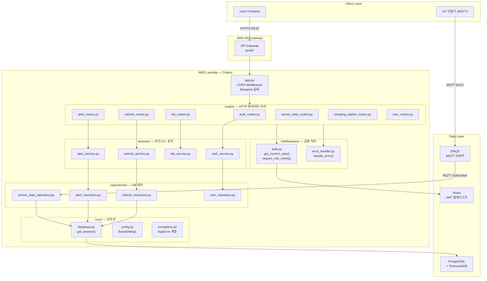
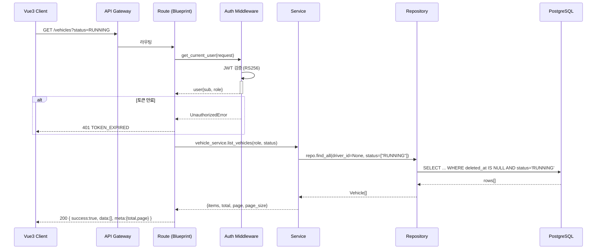

# 15. Backend Architecture — AWS Chalice 백엔드 아키텍처

> **스택**: Python 3.11 · AWS Chalice · SQLModel · PostgreSQL/TimescaleDB · Redis · EMQX MQTT  
> **원칙**: 관심사 분리(SoC) — Route → Service → Repository → DB 단방향 의존성

---

## 목차

1. [아키텍처 개요](#1-아키텍처-개요)
2. [디렉터리 구조](#2-디렉터리-구조)
3. [계층별 책임 정의](#3-계층별-책임-정의)
4. [핵심 모듈 구현](#4-핵심-모듈-구현)
   - 4.1 Chalice 앱 진입점 (`app.py`)
   - 4.2 DB 세션 관리
   - 4.3 인증 헬퍼
   - 4.4 공통 에러 핸들러
   - 4.5 Blueprint 라우터 예시
   - 4.6 Service 레이어 예시
   - 4.7 Repository 레이어
5. [컴포넌트 다이어그램](#5-컴포넌트-다이어그램)
6. [요청 처리 흐름](#6-요청-처리-흐름)

---

## 1. 아키텍처 개요

```
┌────────────────────────────────────────────────────────────┐
│                     AWS API Gateway                        │
└──────────────────────────┬─────────────────────────────────┘
                           │ HTTP
┌──────────────────────────▼─────────────────────────────────┐
│                   AWS Lambda (Chalice)                     │
│                                                            │
│  app.py                                                    │
│  ├── CORS Middleware  (@app.middleware("http"))             │
│  ├── Blueprint: auth_bp    (/auth/*)                       │
│  ├── Blueprint: vehicle_bp (/vehicles/*)                   │
│  ├── Blueprint: alert_bp   (/alerts/*)                     │
│  ├── Blueprint: trip_bp    (/trips/*)                      │
│  ├── Blueprint: station_bp (/charging-stations/*)          │
│  └── Blueprint: user_bp    (/users/*)                      │
│                                                            │
│  chalicelib/                                               │
│  ├── models/      (SQLModel 테이블 정의)                    │
│  ├── services/    (비즈니스 로직)                           │
│  ├── repositories/(DB 쿼리)                                │
│  ├── middlewares/ (JWT 인증 헬퍼)                           │
│  ├── core/        (설정, DB 세션, 예외)                     │
│  └── utils/       (커서 인코딩, 페이지네이션 등)             │
└──────────────────────────┬─────────────────────────────────┘
                           │ SQLAlchemy
        ┌──────────────────┴──────────────────┐
        │                                     │
┌───────▼───────┐                   ┌────────▼────────┐
│  PostgreSQL   │                   │     Redis       │
│ + TimescaleDB │                   │  (JWT 블랙리스트 │
│               │                   │   + 캐시)        │
└───────────────┘                   └─────────────────┘
```

---

## 2. 디렉터리 구조

```
bikeplatform/
├── app.py                          # Chalice 진입점, Blueprint 등록, CORS 미들웨어
├── .chalice/
│   └── config.json                 # Lambda 환경 변수, IAM 역할, 스테이지 설정
├── requirements.txt
└── chalicelib/
    ├── __init__.py
    │
    ├── core/                       # 인프라·설정 레이어
    │   ├── __init__.py
    │   ├── config.py               # Pydantic BaseSettings (환경 변수 로드)
    │   ├── database.py             # SQLAlchemy 엔진, 세션 팩토리, get_session()
    │   ├── redis_client.py         # Redis 연결 (JWT 블랙리스트)
    │   └── exceptions.py           # 도메인 예외 클래스 (AppError 계층)
    │
    ├── models/                     # SQLModel 테이블 정의 (13_database_model.md 참조)
    │   ├── __init__.py
    │   ├── base.py
    │   ├── user.py
    │   ├── driver_profile.py
    │   ├── vehicle.py
    │   ├── charging_station.py
    │   ├── sensor_data.py
    │   ├── alert.py
    │   └── trip.py
    │
    ├── schemas/                    # 요청/응답 Pydantic 스키마 (DB 모델과 분리)
    │   ├── __init__.py
    │   ├── common.py               # SuccessResponse, ErrorResponse, PageMeta, CursorMeta
    │   ├── auth.py                 # LoginRequest, TokenResponse
    │   ├── vehicle.py              # VehicleCreate, VehicleUpdate, VehicleResponse
    │   ├── alert.py
    │   ├── trip.py
    │   ├── sensor_data.py
    │   ├── charging_station.py
    │   └── user.py
    │
    ├── repositories/               # DB 쿼리 전담 (SQLAlchemy/SQLModel)
    │   ├── __init__.py
    │   ├── base_repository.py      # BaseRepository(Generic[ModelT])
    │   ├── user_repository.py
    │   ├── vehicle_repository.py
    │   ├── sensor_data_repository.py
    │   ├── alert_repository.py
    │   ├── trip_repository.py
    │   └── charging_station_repository.py
    │
    ├── services/                   # 비즈니스 로직 전담
    │   ├── __init__.py
    │   ├── auth_service.py
    │   ├── vehicle_service.py
    │   ├── sensor_data_service.py
    │   ├── alert_service.py
    │   ├── trip_service.py
    │   └── charging_station_service.py
    │
    ├── routes/                     # Chalice Blueprint 라우터
    │   ├── __init__.py
    │   ├── auth_routes.py
    │   ├── vehicle_routes.py
    │   ├── sensor_data_routes.py
    │   ├── alert_routes.py
    │   ├── trip_routes.py
    │   ├── charging_station_routes.py
    │   └── user_routes.py
    │
    ├── middlewares/                # 공통 처리 헬퍼
    │   ├── __init__.py
    │   ├── auth.py                 # get_current_user(), require_role_check()
    │   └── error_handler.py        # AppError → HTTP 응답 변환
    │
    └── utils/
        ├── __init__.py
        ├── cursor.py               # encode_cursor_*, decode_cursor()
        ├── pagination.py           # build_offset_meta(), build_cursor_meta()
        ├── jwt_helper.py           # encode_jwt(), decode_jwt()
        └── password.py             # hash_password(), verify_password()
```

---

## 3. 계층별 책임 정의

| 계층 | 위치 | 책임 | 금지 사항 |
|---|---|---|---|
| **Route** | `chalicelib/routes/` | HTTP 파라미터 추출, 인증 헬퍼 호출, 서비스 위임, 응답 직렬화 | 비즈니스 로직, DB 직접 접근 |
| **Service** | `chalicelib/services/` | 비즈니스 규칙 실행, 트랜잭션 경계, 복수 Repository 조합 | HTTP 파라미터 접근, 직접 응답 반환 |
| **Repository** | `chalicelib/repositories/` | SQL 쿼리 전담, 단일 모델 CRUD | 비즈니스 로직, 다른 Repository 직접 호출 |
| **Model** | `chalicelib/models/` | 테이블 스키마 정의, 타입 명세 | 쿼리 로직, 비즈니스 로직 |
| **Schema** | `chalicelib/schemas/` | 요청·응답 직렬화/역직렬화, 유효성 검사 | DB 모델 직접 노출 |

---

## 4. 핵심 모듈 구현

### 4.1 Chalice 앱 진입점 (`app.py`)

```python
# app.py
from chalice import Chalice, CORSConfig, Response

from chalicelib.routes.alert_routes import alert_bp
from chalicelib.routes.auth_routes import auth_bp
from chalicelib.routes.charging_station_routes import station_bp
from chalicelib.routes.sensor_data_routes import sensor_bp
from chalicelib.routes.trip_routes import trip_bp
from chalicelib.routes.user_routes import user_bp
from chalicelib.routes.vehicle_routes import vehicle_bp

app = Chalice(app_name="fms-backend")

# ── Blueprint 등록 ──────────────────────────────────────────
app.register_blueprint(auth_bp,    url_prefix="/auth")
app.register_blueprint(vehicle_bp, url_prefix="/vehicles")
app.register_blueprint(sensor_bp,  url_prefix="/vehicles")   # /vehicles/{id}/sensors
app.register_blueprint(alert_bp,   url_prefix="/alerts")
app.register_blueprint(trip_bp,    url_prefix="/trips")
app.register_blueprint(station_bp, url_prefix="/charging-stations")
app.register_blueprint(user_bp,    url_prefix="/users")


# ── CORS 미들웨어 ────────────────────────────────────────────
# Chalice는 @app.middleware("http") 를 통해 모든 요청/응답을 인터셉트합니다.
@app.middleware("http")
def cors_middleware(event, get_response):
    response = get_response(event)

    # Preflight OPTIONS 요청 처리
    if event.method == "OPTIONS":
        return Response(
            body="",
            status_code=204,
            headers={
                "Access-Control-Allow-Origin":  "https://fms.example.com",
                "Access-Control-Allow-Headers": "Content-Type,Authorization",
                "Access-Control-Allow-Methods": "GET,POST,PUT,PATCH,DELETE,OPTIONS",
                "Access-Control-Allow-Credentials": "true",
            },
        )

    response.headers["Access-Control-Allow-Origin"]      = "https://fms.example.com"
    response.headers["Access-Control-Allow-Credentials"] = "true"
    return response
```

---

### 4.2 DB 세션 관리

```python
# chalicelib/core/database.py
from contextlib import contextmanager
from typing import Generator

from sqlalchemy import create_engine
from sqlalchemy.orm import sessionmaker
from sqlmodel import Session

from chalicelib.core.config import settings

# Lambda 콜드스타트 최소화: 엔진은 모듈 로드 시 1회만 생성
_engine = create_engine(
    settings.database_url,
    pool_pre_ping=True,        # 연결 유효성 사전 확인
    pool_size=2,               # Lambda 동시성 고려 (낮게 유지)
    max_overflow=3,
    pool_timeout=10,
    connect_args={"connect_timeout": 5},
)

_SessionFactory = sessionmaker(bind=_engine, class_=Session, expire_on_commit=False)


@contextmanager
def get_session() -> Generator[Session, None, None]:
    """SQLModel 세션 컨텍스트 매니저.

    사용법:
        with get_session() as session:
            vehicle_repo = VehicleRepository(session)
            ...
    """
    session = _SessionFactory()
    try:
        yield session
        session.commit()
    except Exception:
        session.rollback()
        raise
    finally:
        session.close()
```

---

### 4.3 인증 헬퍼

> **핵심 원칙**: Chalice Blueprint에는 `current_app`이 없습니다.  
> 데코레이터 방식 대신 **헬퍼 함수를 라우터에서 명시적으로 호출**합니다.

```python
# chalicelib/middlewares/auth.py
from typing import Any

from chalicelib.core.exceptions import ForbiddenError, UnauthorizedError
from chalicelib.utils.jwt_helper import decode_jwt


def get_current_user(request: Any) -> dict:
    """Authorization 헤더에서 JWT를 검증하고 페이로드를 반환합니다.

    Args:
        request: Chalice current_request 객체 (Blueprint 내에서 blueprint.current_request)

    Returns:
        dict: {"sub": UUID, "email": str, "role": str, "exp": int}

    Raises:
        UnauthorizedError: 토큰 없음, 만료, 서명 오류
    """
    headers = request.headers or {}
    auth_header = headers.get("authorization", "")

    if not auth_header.startswith("Bearer "):
        raise UnauthorizedError("인증 토큰이 없습니다.")

    token = auth_header.split(" ", 1)[1]

    try:
        return decode_jwt(token)    # RS256 검증, 만료 체크 포함
    except Exception as exc:
        raise UnauthorizedError(str(exc)) from exc


def require_role_check(user: dict, *roles: str) -> None:
    """현재 사용자의 역할(role)이 허용 목록에 포함되는지 검사합니다.

    Args:
        user: get_current_user() 반환 페이로드
        *roles: 허용할 역할 문자열 ("ADMIN", "MANAGER", "DRIVER")

    Raises:
        ForbiddenError: 역할 미충족
    """
    if user.get("role") not in roles:
        raise ForbiddenError(
            f"이 작업은 {', '.join(roles)} 권한이 필요합니다. "
            f"현재 역할: {user.get('role')}"
        )
```

**라우터에서의 실제 사용 패턴**

```python
# chalicelib/routes/vehicle_routes.py (사용 예시)
@vehicle_bp.route("/", methods=["GET"])
def list_vehicles():
    req  = vehicle_bp.current_request
    user = get_current_user(req)           # ① 인증 검증
    # role 체크 없이 모든 인증 사용자 허용 — DRIVER는 Service에서 필터링

    params       = req.query_params or {}
    multi_params = req.multi_query_params or {}
    status_list  = multi_params.get("status") or []  # ② 다중 값 파라미터

    with get_session() as session:
        service = VehicleService(VehicleRepository(session))
        result  = service.list_vehicles(
            user_id   = user["sub"],
            user_role = user["role"],
            status    = status_list,
            page      = int(params.get("page", 1)),
            page_size = int(params.get("page_size", 20)),
        )
    return success_response(result)
```

---

### 4.4 공통 에러 핸들러

```python
# chalicelib/core/exceptions.py
from chalice import BadRequestError, ForbiddenError as ChaliceForbidden
from chalice import NotFoundError, UnauthorizedError as ChaliceUnauthorized


class AppError(Exception):
    """모든 도메인 예외의 기반 클래스."""
    http_status: int = 500
    error_code:  str = "INTERNAL_ERROR"

    def __init__(self, message: str, detail: list | None = None) -> None:
        super().__init__(message)
        self.message = message
        self.detail  = detail


class UnauthorizedError(AppError):
    http_status = 401
    error_code  = "TOKEN_EXPIRED"   # 기본값 (decode_jwt에서 구체적 코드 세팅 가능)


class ForbiddenError(AppError):
    http_status = 403
    error_code  = "FORBIDDEN"


class NotFoundError(AppError):
    http_status = 404

    def __init__(self, resource: str, resource_id: str = "") -> None:
        code = f"{resource.upper()}_NOT_FOUND"
        super().__init__(f"{resource} '{resource_id}'을(를) 찾을 수 없습니다.")
        self.error_code = code


class ConflictError(AppError):
    http_status = 409

    def __init__(self, code: str, message: str) -> None:
        super().__init__(message)
        self.error_code = code


class BusinessError(AppError):
    http_status = 422

    def __init__(self, code: str, message: str) -> None:
        super().__init__(message)
        self.error_code = code


class ValidationError(AppError):
    http_status = 400
    error_code  = "VALIDATION_ERROR"

    def __init__(self, errors: list[dict]) -> None:
        super().__init__("요청 데이터가 유효하지 않습니다.", detail=errors)
```

```python
# chalicelib/middlewares/error_handler.py
import json
import traceback

from chalice import Response

from chalicelib.core.exceptions import AppError


def handle_error(exc: Exception) -> Response:
    """AppError 계층 예외를 공통 에러 응답 JSON으로 변환합니다."""

    if isinstance(exc, AppError):
        body = {
            "success": False,
            "data":    None,
            "meta":    None,
            "error": {
                "code":    exc.error_code,
                "message": exc.message,
                "detail":  exc.detail,
            },
        }
        return Response(
            body=json.dumps(body, ensure_ascii=False),
            status_code=exc.http_status,
            headers={"Content-Type": "application/json; charset=utf-8"},
        )

    # 예상치 못한 예외 — 내부 오류
    traceback.print_exc()
    body = {
        "success": False,
        "data":    None,
        "meta":    None,
        "error": {
            "code":    "INTERNAL_ERROR",
            "message": "서버 내부 오류가 발생했습니다.",
            "detail":  None,
        },
    }
    return Response(
        body=json.dumps(body, ensure_ascii=False),
        status_code=500,
        headers={"Content-Type": "application/json; charset=utf-8"},
    )
```

---

### 4.5 Blueprint 라우터 — 차량 전체 예시

```python
# chalicelib/routes/vehicle_routes.py
from chalice import Blueprint

from chalicelib.core.database import get_session
from chalicelib.middlewares.auth import get_current_user, require_role_check
from chalicelib.middlewares.error_handler import handle_error
from chalicelib.repositories.vehicle_repository import VehicleRepository
from chalicelib.services.vehicle_service import VehicleService
from chalicelib.schemas.common import success_response

vehicle_bp = Blueprint(__name__)


@vehicle_bp.route("/", methods=["GET"])
def list_vehicles():
    try:
        req  = vehicle_bp.current_request
        user = get_current_user(req)

        params  = req.query_params or {}
        multi   = req.multi_query_params or {}

        with get_session() as session:
            svc  = VehicleService(VehicleRepository(session))
            data = svc.list_vehicles(
                caller_id   = user["sub"],
                caller_role = user["role"],
                status      = multi.get("status") or [],
                q           = params.get("q"),
                page        = int(params.get("page", 1)),
                page_size   = min(int(params.get("page_size", 20)), 100),
            )
        return success_response(data)
    except Exception as exc:
        return handle_error(exc)


@vehicle_bp.route("/", methods=["POST"])
def create_vehicle():
    try:
        req  = vehicle_bp.current_request
        user = get_current_user(req)
        require_role_check(user, "ADMIN", "MANAGER")

        body = req.json_body or {}
        with get_session() as session:
            svc  = VehicleService(VehicleRepository(session))
            data = svc.create_vehicle(body)
        return success_response(data, status_code=201)
    except Exception as exc:
        return handle_error(exc)


@vehicle_bp.route("/{vehicle_id}", methods=["GET"])
def get_vehicle(vehicle_id: str):
    try:
        req  = vehicle_bp.current_request
        user = get_current_user(req)

        with get_session() as session:
            svc  = VehicleService(VehicleRepository(session))
            data = svc.get_vehicle_detail(
                vehicle_id  = vehicle_id,
                caller_id   = user["sub"],
                caller_role = user["role"],
            )
        return success_response(data)
    except Exception as exc:
        return handle_error(exc)


@vehicle_bp.route("/{vehicle_id}", methods=["PUT"])
def update_vehicle(vehicle_id: str):
    try:
        req  = vehicle_bp.current_request
        user = get_current_user(req)
        require_role_check(user, "ADMIN", "MANAGER")

        body = req.json_body or {}
        with get_session() as session:
            svc  = VehicleService(VehicleRepository(session))
            data = svc.update_vehicle(vehicle_id, body)
        return success_response(data)
    except Exception as exc:
        return handle_error(exc)


@vehicle_bp.route("/{vehicle_id}", methods=["DELETE"])
def delete_vehicle(vehicle_id: str):
    try:
        req  = vehicle_bp.current_request
        user = get_current_user(req)
        require_role_check(user, "ADMIN")

        with get_session() as session:
            svc = VehicleService(VehicleRepository(session))
            svc.soft_delete_vehicle(vehicle_id)
        from chalice import Response
        return Response(body="", status_code=204)
    except Exception as exc:
        return handle_error(exc)
```

---

### 4.6 Service 레이어 — 차량 서비스 예시

```python
# chalicelib/services/vehicle_service.py
from uuid import UUID

from chalicelib.core.exceptions import (
    BusinessError, ConflictError, ForbiddenError, NotFoundError, ValidationError,
)
from chalicelib.models.vehicle import Vehicle, VehicleStatus
from chalicelib.repositories.vehicle_repository import VehicleRepository
from chalicelib.schemas.vehicle import VehicleCreate, VehicleUpdate


class VehicleService:
    def __init__(self, repo: VehicleRepository) -> None:
        self._repo = repo

    def list_vehicles(
        self,
        caller_id: str,
        caller_role: str,
        status: list[str],
        q: str | None,
        page: int,
        page_size: int,
    ) -> dict:
        """DRIVER 역할은 본인 배차 차량만 조회합니다."""
        driver_id = caller_id if caller_role == "DRIVER" else None

        items, total = self._repo.find_all(
            driver_id=driver_id,
            status=status,
            q=q,
            page=page,
            page_size=page_size,
        )
        return {
            "items": [self._to_list_response(v) for v in items],
            "total": total,
            "page": page,
            "page_size": page_size,
        }

    def create_vehicle(self, data: dict) -> dict:
        """번호판 중복 체크 후 차량 생성."""
        body = VehicleCreate(**data)  # Pydantic 유효성 검사

        if self._repo.exists_by_plate(body.plate_number):
            raise ConflictError("DUPLICATE_PLATE", f"번호판 '{body.plate_number}'이 이미 등록되어 있습니다.")

        vehicle = Vehicle(**body.model_dump())
        created = self._repo.create(vehicle)
        return self._to_detail_response(created)

    def get_vehicle_detail(self, vehicle_id: str, caller_id: str, caller_role: str) -> dict:
        vehicle = self._get_or_raise(vehicle_id)

        # DRIVER는 본인 배차 차량만 접근 가능
        if caller_role == "DRIVER":
            driver_profile_id = self._repo.get_driver_profile_id(caller_id)
            if str(vehicle.assigned_driver_id) != str(driver_profile_id):
                raise ForbiddenError("본인 배차 차량만 조회할 수 있습니다.")

        return self._to_detail_response(vehicle)

    def update_vehicle(self, vehicle_id: str, data: dict) -> dict:
        vehicle = self._get_or_raise(vehicle_id)
        update  = VehicleUpdate(**data)

        # 배차 변경 시 이미 다른 차량에 배차된 기사인지 확인
        if update.assigned_driver_id is not None:
            conflict = self._repo.find_assigned_vehicle(update.assigned_driver_id)
            if conflict and str(conflict.id) != vehicle_id:
                raise BusinessError(
                    "DRIVER_ALREADY_ASSIGNED",
                    "해당 기사는 이미 다른 차량에 배차되어 있습니다.",
                )

        for field, value in update.model_dump(exclude_unset=True).items():
            setattr(vehicle, field, value)

        saved = self._repo.save(vehicle)
        return self._to_detail_response(saved)

    def soft_delete_vehicle(self, vehicle_id: str) -> None:
        vehicle = self._get_or_raise(vehicle_id)

        if self._repo.has_sensor_data(vehicle.id):
            raise BusinessError(
                "VEHICLE_HAS_DATA",
                "센서 데이터가 존재하는 차량은 삭제할 수 없습니다. 아카이브 배치를 먼저 실행하세요.",
            )
        self._repo.soft_delete(vehicle)

    # ── Private ──────────────────────────────────────────────
    def _get_or_raise(self, vehicle_id: str) -> Vehicle:
        vehicle = self._repo.find_by_id(UUID(vehicle_id))
        if not vehicle:
            raise NotFoundError("Vehicle", vehicle_id)
        return vehicle

    def _to_list_response(self, v: Vehicle) -> dict:
        return {
            "id": str(v.id),
            "plate_number": v.plate_number,
            "model": v.model,
            "status": v.status,
            "battery_capacity_kwh": v.battery_capacity_kwh,
        }

    def _to_detail_response(self, v: Vehicle) -> dict:
        return {
            "id": str(v.id),
            "plate_number": v.plate_number,
            "model": v.model,
            "manufacturer": v.manufacturer,
            "manufacture_year": v.manufacture_year,
            "status": v.status,
            "battery_capacity_kwh": v.battery_capacity_kwh,
            "vin": v.vin,
            "created_at": v.created_at.isoformat(),
            "updated_at": v.updated_at.isoformat(),
        }
```

---

### 4.7 Repository 레이어 — Generic BaseRepository

```python
# chalicelib/repositories/base_repository.py
from typing import Generic, Optional, Type, TypeVar
from uuid import UUID

from sqlmodel import Session, SQLModel, select

from chalicelib.models.base import SoftDeleteMixin, utcnow

ModelT = TypeVar("ModelT", bound=SQLModel)


class BaseRepository(Generic[ModelT]):
    def __init__(self, model_class: Type[ModelT], session: Session) -> None:
        self._model   = model_class
        self._session = session

    def find_by_id(self, record_id: UUID) -> Optional[ModelT]:
        stmt = select(self._model).where(self._model.id == record_id)
        if issubclass(self._model, SoftDeleteMixin):
            stmt = stmt.where(self._model.deleted_at.is_(None))
        return self._session.exec(stmt).first()

    def create(self, instance: ModelT) -> ModelT:
        self._session.add(instance)
        self._session.flush()   # ID 할당 (commit은 get_session() 컨텍스트에서)
        self._session.refresh(instance)
        return instance

    def save(self, instance: ModelT) -> ModelT:
        self._session.add(instance)
        self._session.flush()
        self._session.refresh(instance)
        return instance

    def soft_delete(self, instance: SoftDeleteMixin) -> None:
        instance.deleted_at = utcnow()
        self._session.add(instance)
        self._session.flush()
```

---

## 5. 컴포넌트 다이어그램



---

## 6. 요청 처리 흐름


