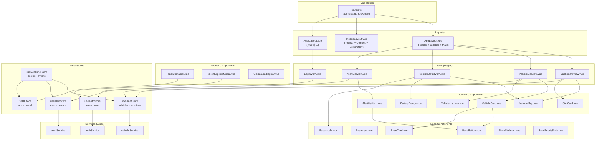

# 16. Frontend Architecture — Vue3 프론트엔드 아키텍처

> **스택**: Vue 3.4 · TypeScript · Vite · Pinia · Vue Router 4 · Axios · Socket.IO · TailwindCSS v3  
> **원칙**: 단방향 데이터 흐름 — View → Store → Service → API

---

## 목차

1. [아키텍처 개요](#1-아키텍처-개요)
2. [디렉터리 구조](#2-디렉터리-구조)
3. [계층별 책임 정의](#3-계층별-책임-정의)
4. [Pinia 스토어 설계](#4-pinia-스토어-설계)
   - 4.1 useAuthStore
   - 4.2 useFleetStore
   - 4.3 useAlertStore
   - 4.4 useRealtimeStore
   - 4.5 useUIStore
5. [HTTP 서비스 레이어 (Axios)](#5-http-서비스-레이어-axios)
6. [Vue Router 가드](#6-vue-router-가드)
7. [컴포넌트 계층 구조 다이어그램](#7-컴포넌트-계층-구조-다이어그램)
8. [타입 정의](#8-타입-정의)

---

## 1. 아키텍처 개요

```
┌────────────────────────────────────────────────────────────┐
│                        Browser                             │
│                                                            │
│  Vue Router ──► AppLayout / MobileLayout / AuthLayout     │
│       │                    │                               │
│       │              Views (Pages)                         │
│       │         DashboardView / VehicleDetailView / ...    │
│       │                    │ Props / Emits                  │
│       │         Domain Components                          │
│       │         VehicleCard / AlertListItem / ...          │
│       │                    │                               │
│       └──────► Base Components                             │
│                BaseButton / BaseInput / BaseModal          │
│                                                            │
│  Pinia Stores ◄──── Views / Components                     │
│  ├── useAuthStore     (인증·사용자 정보)                    │
│  ├── useFleetStore    (차량 목록·상세)                      │
│  ├── useAlertStore    (알림 목록·상태)                      │
│  ├── useRealtimeStore (WebSocket·실시간 위치)               │
│  └── useUIStore       (Toast·Sidebar·Global Loading)       │
│              │                                             │
│  Services ◄──┘                                             │
│  ├── authService      (Axios + /auth/*)                    │
│  ├── vehicleService   (Axios + /vehicles/*)                │
│  ├── alertService     (Axios + /alerts/*)                  │
│  └── ...                                                   │
│              │                                             │
│  Axios Instance (인터셉터: 토큰 주입, 자동 갱신, 에러 파싱) │
└──────────────┬─────────────────────────────────────────────┘
               │ HTTPS / WebSocket
         AWS API Gateway / Socket.IO
```

---

## 2. 디렉터리 구조

```
src/
├── main.ts                         # 앱 진입점 (Pinia, Router, 다크모드 초기화)
├── App.vue                         # 루트 컴포넌트 (RouterView + ToastContainer)
│
├── layouts/
│   ├── AppLayout.vue               # 관제 대시보드 레이아웃 (Header + Sidebar + Main)
│   ├── MobileLayout.vue            # 모바일 앱 레이아웃 (TopBar + Content + BottomNav)
│   └── AuthLayout.vue              # 인증 페이지 레이아웃 (중앙 카드)
│
├── views/                          # 페이지 단위 컴포넌트 (라우터와 1:1 대응)
│   ├── auth/
│   │   ├── LoginView.vue
│   │   └── ForgotPasswordView.vue
│   ├── dashboard/
│   │   └── DashboardView.vue       # 관제 대시보드 메인
│   ├── vehicles/
│   │   ├── VehicleListView.vue     # 차량 목록 (모바일)
│   │   └── VehicleDetailView.vue   # 차량 상세 + 궤적
│   ├── alerts/
│   │   └── AlertListView.vue       # 알림 목록 (무한 스크롤)
│   ├── trips/
│   │   └── TripListView.vue        # 운행 기록
│   └── errors/
│       ├── NotFoundView.vue
│       └── ForbiddenView.vue
│
├── components/
│   ├── base/                       # Atomic — 재사용 단위 (도메인 무관)
│   │   ├── BaseButton.vue
│   │   ├── BaseInput.vue
│   │   ├── BaseCard.vue
│   │   ├── BaseModal.vue
│   │   ├── BaseListItem.vue
│   │   ├── BaseBadge.vue
│   │   ├── BaseSelect.vue
│   │   ├── BaseSkeleton.vue        # 로딩 스켈레톤
│   │   └── BaseEmptyState.vue      # 빈 상태 표시
│   │
│   ├── domain/                     # Compound — 도메인 특화 컴포넌트
│   │   ├── vehicle/
│   │   │   ├── VehicleStatusBadge.vue
│   │   │   ├── VehicleCard.vue
│   │   │   ├── VehicleListItem.vue
│   │   │   ├── VehicleMap.vue      # Leaflet/Mapbox 지도
│   │   │   └── VehicleFilterBar.vue
│   │   ├── alert/
│   │   │   ├── AlertListItem.vue
│   │   │   ├── AlertSeverityBadge.vue
│   │   │   └── AlertAcknowledgeModal.vue
│   │   ├── dashboard/
│   │   │   ├── StatCard.vue
│   │   │   └── KpiRow.vue
│   │   └── sensor/
│   │       └── BatteryGauge.vue
│   │
│   └── global/                     # 전역 싱글턴 컴포넌트
│       ├── ToastContainer.vue
│       ├── GlobalLoadingBar.vue
│       └── TokenExpiredModal.vue
│
├── stores/                         # Pinia 도메인 스토어
│   ├── auth.ts                     # useAuthStore
│   ├── fleet.ts                    # useFleetStore
│   ├── alert.ts                    # useAlertStore
│   ├── realtime.ts                 # useRealtimeStore
│   └── ui.ts                       # useUIStore
│
├── services/                       # Axios 기반 API 호출 함수
│   ├── http.ts                     # Axios 인스턴스 + 인터셉터
│   ├── authService.ts
│   ├── vehicleService.ts
│   ├── alertService.ts
│   ├── tripService.ts
│   ├── sensorDataService.ts
│   └── chargingStationService.ts
│
├── composables/                    # 재사용 가능한 Composition 함수
│   ├── useDelayedLoading.ts        # 300ms 임계값 스켈레톤 제어
│   ├── useInfiniteScroll.ts        # IntersectionObserver 무한 스크롤
│   ├── usePagination.ts            # Offset 페이지네이션 상태 관리
│   ├── useToast.ts                 # Toast 알림 단축 함수
│   └── useVehicleFilter.ts         # 차량 필터 상태 관리
│
├── router/
│   ├── index.ts                    # createRouter, 라우트 정의
│   ├── guards/
│   │   ├── authGuard.ts            # 미인증 → /login 리다이렉트
│   │   └── roleGuard.ts            # 역할 미충족 → /403
│   └── routes.ts                   # 라우트 테이블 (meta.roles 포함)
│
├── types/
│   ├── api.ts                      # ApiResponse<T>, PageMeta, CursorMeta
│   ├── models.ts                   # Vehicle, Alert, Trip, User 인터페이스
│   ├── enums.ts                    # VehicleStatus, AlertType, UserRole enum
│   └── axios.d.ts                  # InternalAxiosRequestConfig._retry 확장
│
└── utils/
    ├── formatters.ts               # 날짜, 숫자, 거리 포맷
    └── validators.ts               # 이메일, 번호판 유효성 검사
```

---

## 3. 계층별 책임 정의

| 계층 | 위치 | 책임 | 금지 사항 |
|---|---|---|---|
| **View** | `views/` | 페이지 레이아웃, Store 액션 호출, 라우팅 | 직접 API 호출 (Service 경유 필수) |
| **Component** | `components/` | UI 렌더링, Props 수신, Emits 발생 | Store 직접 접근 (부모 View를 경유) |
| **Store** | `stores/` | 전역 상태 관리, Service 호출, 상태 파생 | DOM 직접 조작 |
| **Service** | `services/` | Axios HTTP 호출, 응답 `.data` 추출 | 상태 직접 변경 |
| **Composable** | `composables/` | 재사용 로직 캡슐화 (로딩, 무한스크롤 등) | 전역 Store 남용 |

---

## 4. Pinia 스토어 설계

### 4.1 useAuthStore

```typescript
// src/stores/auth.ts
import { ref, computed } from "vue"
import { defineStore } from "pinia"
import { authService } from "@/services/authService"
import type { User } from "@/types/models"

export const useAuthStore = defineStore("auth", () => {
  // ── State ────────────────────────────────────────────────
  const accessToken  = ref<string | null>(localStorage.getItem("access_token"))
  const currentUser  = ref<User | null>(null)
  const isLoading    = ref(false)

  // ── Getters ──────────────────────────────────────────────
  const isAuthenticated = computed(() => !!accessToken.value)
  const userRole        = computed(() => currentUser.value?.role ?? null)
  const isAdmin         = computed(() => userRole.value === "ADMIN")
  const isManager       = computed(() => ["ADMIN", "MANAGER"].includes(userRole.value ?? ""))

  // ── Actions ──────────────────────────────────────────────
  async function login(email: string, password: string): Promise<void> {
    isLoading.value = true
    try {
      const data = await authService.login({ email, password })
      accessToken.value = data.access_token
      currentUser.value = data.user
      localStorage.setItem("access_token", data.access_token)
    } finally {
      isLoading.value = false
    }
  }

  async function refresh(): Promise<string> {
    /**
     * Refresh Token(HttpOnly Cookie)을 사용해 새 Access Token을 발급합니다.
     * Axios 인터셉터에서 TOKEN_EXPIRED 시 자동 호출됩니다.
     */
    const data = await authService.refresh()
    accessToken.value = data.access_token
    localStorage.setItem("access_token", data.access_token)
    return data.access_token
  }

  async function fetchMe(): Promise<void> {
    /**
     * 페이지 새로고침 후 currentUser 복원.
     * authGuard에서 accessToken은 있지만 currentUser가 null인 경우 호출됩니다.
     */
    currentUser.value = await authService.getMe()
  }

  async function logout(): Promise<void> {
    await authService.logout().catch(() => {})  // 서버 오류 무시
    accessToken.value = null
    currentUser.value = null
    localStorage.removeItem("access_token")
  }

  return {
    // State
    accessToken, currentUser, isLoading,
    // Getters
    isAuthenticated, userRole, isAdmin, isManager,
    // Actions
    login, refresh, fetchMe, logout,
  }
})
```

---

### 4.2 useFleetStore

```typescript
// src/stores/fleet.ts
import { ref, computed } from "vue"
import { defineStore } from "pinia"
import { vehicleService } from "@/services/vehicleService"
import { sensorDataService } from "@/services/sensorDataService"
import type { Vehicle, LatestSensor } from "@/types/models"
import type { PageMeta } from "@/types/api"

export const useFleetStore = defineStore("fleet", () => {
  // ── State ────────────────────────────────────────────────
  const vehicles         = ref<Vehicle[]>([])
  const selectedVehicle  = ref<Vehicle | null>(null)
  const pageMeta         = ref<PageMeta | null>(null)
  const isListLoading    = ref(false)
  const isDetailLoading  = ref(false)

  // 실시간 위치 오버레이 (WebSocket VEHICLE_LOCATION_UPDATE 수신 시 갱신)
  const realtimeLocations = ref<Map<string, LatestSensor>>(new Map())

  // ── Getters ──────────────────────────────────────────────
  const vehicleById = computed(() =>
    (id: string) => vehicles.value.find(v => v.id === id) ?? null
  )

  const alertVehicles = computed(() =>
    vehicles.value.filter(v => v.status === "ALERT")
  )

  const offlineVehicles = computed(() =>
    vehicles.value.filter(v => v.status === "OFFLINE")
  )

  // ── Actions ──────────────────────────────────────────────
  async function fetchVehicles(params?: {
    status?: string[]
    q?: string
    page?: number
    page_size?: number
  }): Promise<void> {
    isListLoading.value = true
    try {
      const res = await vehicleService.list(params)
      vehicles.value = res.data
      pageMeta.value  = res.meta
    } finally {
      isListLoading.value = false
    }
  }

  async function fetchVehicleDetail(vehicleId: string): Promise<void> {
    isDetailLoading.value = true
    try {
      selectedVehicle.value = await vehicleService.getById(vehicleId)
    } finally {
      isDetailLoading.value = false
    }
  }

  function updateRealtimeLocation(vehicleId: string, sensor: LatestSensor): void {
    /**
     * useRealtimeStore의 VEHICLE_LOCATION_UPDATE 이벤트 핸들러에서 호출됩니다.
     * Map을 새로 할당해야 Vue reactivity가 트리거됩니다.
     */
    const next = new Map(realtimeLocations.value)
    next.set(vehicleId, sensor)
    realtimeLocations.value = next
  }

  function clearSelectedVehicle(): void {
    selectedVehicle.value = null
  }

  return {
    // State
    vehicles, selectedVehicle, pageMeta, isListLoading, isDetailLoading, realtimeLocations,
    // Getters
    vehicleById, alertVehicles, offlineVehicles,
    // Actions
    fetchVehicles, fetchVehicleDetail, updateRealtimeLocation, clearSelectedVehicle,
  }
})
```

---

### 4.3 useAlertStore

```typescript
// src/stores/alert.ts
import { ref, computed } from "vue"
import { defineStore } from "pinia"
import { alertService } from "@/services/alertService"
import { encode_cursor_time_id } from "@/utils/cursor"
import type { Alert } from "@/types/models"

export const useAlertStore = defineStore("alert", () => {
  // ── State ────────────────────────────────────────────────
  const alerts     = ref<Alert[]>([])
  const nextCursor = ref<string | null>(null)
  const hasNext    = ref(false)
  const isLoading  = ref(false)
  const isLoadingMore = ref(false)

  // ── Getters ──────────────────────────────────────────────
  const unacknowledgedCount = computed(
    () => alerts.value.filter(a => !a.is_acknowledged).length
  )

  const dangerAlerts = computed(
    () => alerts.value.filter(a => a.severity === "DANGER")
  )

  // ── Actions ──────────────────────────────────────────────
  async function fetchAlerts(params?: {
    vehicle_id?: string
    severity?: string[]
    is_acknowledged?: boolean
  }): Promise<void> {
    /**첫 페이지 로드 — 기존 목록 초기화 후 새로 로드합니다. */
    isLoading.value = true
    try {
      const res    = await alertService.list({ limit: 30, ...params })
      alerts.value = res.data
      nextCursor.value = res.meta.next_cursor
      hasNext.value    = res.meta.has_next
    } finally {
      isLoading.value = false
    }
  }

  async function loadMore(): Promise<void> {
    /** 무한 스크롤 — cursor 기반 다음 페이지 추가 로드. */
    if (!hasNext.value || isLoadingMore.value) return

    isLoadingMore.value = true
    try {
      const res = await alertService.list({ limit: 30, cursor: nextCursor.value ?? undefined })
      alerts.value     = [...alerts.value, ...res.data]
      nextCursor.value = res.meta.next_cursor
      hasNext.value    = res.meta.has_next
    } finally {
      isLoadingMore.value = false
    }
  }

  async function acknowledge(alertId: string): Promise<void> {
    const updated = await alertService.acknowledge(alertId)
    const idx = alerts.value.findIndex(a => a.id === alertId)
    if (idx !== -1) alerts.value[idx] = updated
  }

  function prependAlert(newAlert: Alert): void {
    /**
     * useRealtimeStore의 ALERT_TRIGGERED 이벤트 핸들러에서 호출됩니다.
     * 실시간으로 수신된 알림을 목록 최상단에 삽입합니다.
     */
    alerts.value = [newAlert, ...alerts.value]
  }

  return {
    // State
    alerts, nextCursor, hasNext, isLoading, isLoadingMore,
    // Getters
    unacknowledgedCount, dangerAlerts,
    // Actions
    fetchAlerts, loadMore, acknowledge, prependAlert,
  }
})
```

---

### 4.4 useRealtimeStore

```typescript
// src/stores/realtime.ts
import { ref } from "vue"
import { defineStore } from "pinia"
import { io, Socket } from "socket.io-client"
import { useAuthStore } from "./auth"
import { useFleetStore } from "./fleet"
import { useAlertStore } from "./alert"
import { useUIStore } from "./ui"

export const useRealtimeStore = defineStore("realtime", () => {
  const socket         = ref<Socket | null>(null)
  const isConnected    = ref(false)
  const subscribedIds  = ref<Set<string>>(new Set())

  function connect(vehicleIds: string[]): void {
    const auth = useAuthStore()

    // 중복 연결 방지 — 이미 연결되어 있으면 구독만 추가
    if (socket.value?.connected) {
      socket.value.emit("SUBSCRIBE", { vehicle_ids: vehicleIds })
      vehicleIds.forEach(id => subscribedIds.value.add(id))
      return
    }

    socket.value = io("/realtime", {
      auth: { token: auth.accessToken },
      transports: ["websocket"],
      reconnectionAttempts: 5,
      reconnectionDelay: 2000,
    })

    // ── 시스템 이벤트 ─────────────────────────────────────
    socket.value.on("connect", () => {
      isConnected.value = true
      socket.value!.emit("SUBSCRIBE", { vehicle_ids: vehicleIds })
      vehicleIds.forEach(id => subscribedIds.value.add(id))
    })

    socket.value.on("disconnect", () => {
      isConnected.value = false
    })

    socket.value.on("error", (err: { code: string; message: string }) => {
      if (err.code === "TOKEN_EXPIRED") disconnect()
    })

    // ── 도메인 이벤트 ─────────────────────────────────────
    socket.value.on("VEHICLE_LOCATION_UPDATE", (payload) => {
      useFleetStore().updateRealtimeLocation(payload.vehicle_id, payload)
    })

    socket.value.on("ALERT_TRIGGERED", (payload) => {
      useAlertStore().prependAlert(payload)
      useUIStore().addToast({
        type: payload.severity === "DANGER" ? "error" : "warning",
        message: payload.title,
        duration: 7000,
      })
    })

    socket.value.on("BATTERY_REPLACE_REQUIRED", (payload) => {
      useUIStore().openBatteryModal(payload)
    })

    socket.value.on("VEHICLE_STATUS_CHANGED", (payload) => {
      useFleetStore().fetchVehicles()  // 상태 변경 시 목록 갱신
    })
  }

  function disconnect(): void {
    socket.value?.disconnect()
    socket.value    = null
    isConnected.value   = false
    subscribedIds.value = new Set()
  }

  function subscribe(vehicleIds: string[]): void {
    if (!socket.value?.connected) return
    socket.value.emit("SUBSCRIBE", { vehicle_ids: vehicleIds })
    vehicleIds.forEach(id => subscribedIds.value.add(id))
  }

  function unsubscribe(vehicleIds: string[]): void {
    if (!socket.value?.connected) return
    socket.value.emit("UNSUBSCRIBE", { vehicle_ids: vehicleIds })
    vehicleIds.forEach(id => subscribedIds.value.delete(id))
  }

  return {
    socket, isConnected, subscribedIds,
    connect, disconnect, subscribe, unsubscribe,
  }
})
```

---

### 4.5 useUIStore

```typescript
// src/stores/ui.ts
import { ref } from "vue"
import { defineStore } from "pinia"

export type ToastType = "success" | "warning" | "error" | "info"

export interface ToastItem {
  id:       string
  type:     ToastType
  message:  string
  duration: number
}

export const useUIStore = defineStore("ui", () => {
  // ── State ─────────────────────────────────────────────────
  const isSidebarCollapsed   = ref(false)
  const isGlobalLoading      = ref(false)
  const toastQueue           = ref<ToastItem[]>([])
  const batteryModalPayload  = ref<any | null>(null)
  const showTokenExpiredModal = ref(false)

  // ── Actions ───────────────────────────────────────────────
  function addToast(item: Omit<ToastItem, "id">): string {
    const id = `toast_${Date.now()}_${Math.random().toString(36).slice(2, 7)}`
    toastQueue.value.push({ ...item, id })
    setTimeout(() => removeToast(id), item.duration)
    return id
  }

  function removeToast(id: string): void {
    toastQueue.value = toastQueue.value.filter(t => t.id !== id)
  }

  function openBatteryModal(payload: any): void {
    batteryModalPayload.value = payload
  }

  function closeBatteryModal(): void {
    batteryModalPayload.value = null
  }

  function toggleSidebar(): void {
    isSidebarCollapsed.value = !isSidebarCollapsed.value
  }

  function setTokenExpired(value: boolean): void {
    showTokenExpiredModal.value = value
  }

  return {
    isSidebarCollapsed, isGlobalLoading, toastQueue, batteryModalPayload, showTokenExpiredModal,
    addToast, removeToast, openBatteryModal, closeBatteryModal, toggleSidebar, setTokenExpired,
  }
})
```

---

## 5. HTTP 서비스 레이어 (Axios)

```typescript
// src/services/http.ts
import axios, { type AxiosInstance, type InternalAxiosRequestConfig } from "axios"
import { useAuthStore } from "@/stores/auth"
import { useUIStore } from "@/stores/ui"

// Axios 타입 확장 (TypeScript 컴파일 에러 방지)
// src/types/axios.d.ts 에도 선언 필요
declare module "axios" {
  interface InternalAxiosRequestConfig {
    _retry?: boolean
  }
}

const http: AxiosInstance = axios.create({
  baseURL:         import.meta.env.VITE_API_BASE_URL,
  timeout:         15_000,
  withCredentials: true,   // Refresh Token 쿠키 자동 전송
  headers:         { "Content-Type": "application/json" },
})

// ── 요청 인터셉터: Access Token 자동 주입 ───────────────────
http.interceptors.request.use((config: InternalAxiosRequestConfig) => {
  const auth = useAuthStore()
  if (auth.accessToken) {
    config.headers.Authorization = `Bearer ${auth.accessToken}`
  }
  return config
})

// ── 응답 인터셉터: 에러 처리 + 토큰 자동 갱신 ──────────────
http.interceptors.response.use(
  // 성공: response.data (봉투 전체) 반환 → 각 service에서 .data 접근
  (response) => response.data,

  async (error) => {
    const original  = error.config as InternalAxiosRequestConfig
    const errorCode = error.response?.data?.error?.code

    // TOKEN_EXPIRED → 1회만 갱신 시도
    if (errorCode === "TOKEN_EXPIRED" && !original._retry) {
      original._retry = true
      try {
        const auth = useAuthStore()
        await auth.refresh()
        await auth.fetchMe()  // currentUser 복원 (페이지 새로고침 대응)
        return http(original)  // 원래 요청 재시도
      } catch {
        // 갱신 실패 → 로그아웃 + 만료 모달 표시
        const auth = useAuthStore()
        const ui   = useUIStore()
        await auth.logout()
        ui.setTokenExpired(true)
        return Promise.reject(error)
      }
    }

    return Promise.reject(error)
  }
)

export default http
```

**vehicleService 예시**

```typescript
// src/services/vehicleService.ts
import http from "./http"
import type { ApiListResponse, ApiSingleResponse } from "@/types/api"
import type { Vehicle } from "@/types/models"

export const vehicleService = {
  async list(params?: {
    page?: number
    page_size?: number
    status?: string[]
    q?: string
  }): Promise<ApiListResponse<Vehicle>> {
    // Axios 인터셉터가 response.data(봉투) 반환 → 그 자체가 {success, data, meta}
    return http.get("/vehicles", { params })
  },

  async getById(id: string): Promise<Vehicle> {
    const res: ApiSingleResponse<Vehicle> = await http.get(`/vehicles/${id}`)
    return res.data  // 봉투에서 실제 데이터 추출
  },

  async create(body: Partial<Vehicle>): Promise<Vehicle> {
    const res: ApiSingleResponse<Vehicle> = await http.post("/vehicles", body)
    return res.data
  },

  async update(id: string, body: Partial<Vehicle>): Promise<Vehicle> {
    const res: ApiSingleResponse<Vehicle> = await http.put(`/vehicles/${id}`, body)
    return res.data
  },

  async remove(id: string): Promise<void> {
    await http.delete(`/vehicles/${id}`)
  },
}
```

---

## 6. Vue Router 가드

```typescript
// src/router/guards/authGuard.ts
import type { NavigationGuardNext, RouteLocationNormalized } from "vue-router"
import { useAuthStore } from "@/stores/auth"

export async function authGuard(
  to: RouteLocationNormalized,
  _from: RouteLocationNormalized,
  next: NavigationGuardNext,
): Promise<void> {
  const auth = useAuthStore()

  if (!auth.isAuthenticated) {
    return next({ path: "/login", query: { redirect: to.fullPath } })
  }

  // 페이지 새로고침 시: accessToken은 localStorage에 있지만 currentUser가 null
  if (!auth.currentUser) {
    try {
      await auth.fetchMe()   // GET /auth/me 로 사용자 정보 복원
    } catch {
      await auth.logout()
      return next({ path: "/login" })
    }
  }

  next()
}
```

```typescript
// src/router/guards/roleGuard.ts
import type { NavigationGuardNext, RouteLocationNormalized } from "vue-router"
import { useAuthStore } from "@/stores/auth"

export function roleGuard(
  to: RouteLocationNormalized,
  _from: RouteLocationNormalized,
  next: NavigationGuardNext,
): void {
  const requiredRoles = to.meta.roles as string[] | undefined
  if (!requiredRoles || requiredRoles.length === 0) return next()

  const auth = useAuthStore()
  const role = auth.currentUser?.role

  if (!role || !requiredRoles.includes(role)) {
    return next({ path: "/403" })
  }
  next()
}
```

```typescript
// src/router/routes.ts
import type { RouteRecordRaw } from "vue-router"
import AppLayout    from "@/layouts/AppLayout.vue"
import MobileLayout from "@/layouts/MobileLayout.vue"
import AuthLayout   from "@/layouts/AuthLayout.vue"

export const routes: RouteRecordRaw[] = [
  // ── 인증 페이지 (레이아웃: AuthLayout) ────────────────────
  {
    path: "/",
    component: AuthLayout,
    children: [
      { path: "login", name: "Login", component: () => import("@/views/auth/LoginView.vue") },
    ],
  },

  // ── 관제 대시보드 (레이아웃: AppLayout, 인증 필요) ─────────
  {
    path: "/app",
    component: AppLayout,
    meta: { requiresAuth: true },
    children: [
      {
        path: "dashboard",
        name: "Dashboard",
        component: () => import("@/views/dashboard/DashboardView.vue"),
      },
      {
        path: "vehicles",
        name: "VehicleList",
        component: () => import("@/views/vehicles/VehicleListView.vue"),
      },
      {
        path: "vehicles/:vehicleId",
        name: "VehicleDetail",
        component: () => import("@/views/vehicles/VehicleDetailView.vue"),
      },
      {
        path: "alerts",
        name: "AlertList",
        component: () => import("@/views/alerts/AlertListView.vue"),
      },
      {
        path: "trips",
        name: "TripList",
        component: () => import("@/views/trips/TripListView.vue"),
      },
    ],
  },

  // ── 모바일 앱 (레이아웃: MobileLayout) ─────────────────────
  {
    path: "/mobile",
    component: MobileLayout,
    meta: { requiresAuth: true },
    children: [
      {
        path: "vehicles",
        name: "MobileVehicleList",
        component: () => import("@/views/vehicles/VehicleListView.vue"),
      },
      {
        path: "vehicles/:vehicleId",
        name: "MobileVehicleDetail",
        component: () => import("@/views/vehicles/VehicleDetailView.vue"),
      },
    ],
  },

  // ── 에러 페이지 ────────────────────────────────────────────
  { path: "/403", name: "Forbidden",  component: () => import("@/views/errors/ForbiddenView.vue") },
  { path: "/:pathMatch(.*)*", name: "NotFound", component: () => import("@/views/errors/NotFoundView.vue") },
]
```

---

## 7. 컴포넌트 계층 구조 다이어그램



---

## 8. 타입 정의

```typescript
// src/types/api.ts
export interface ApiSingleResponse<T> {
  success: boolean
  data: T
  meta: null
}

export interface ApiListResponse<T> {
  success: boolean
  data: T[]
  meta: PageMeta
}

export interface ApiCursorResponse<T> {
  success: boolean
  data: T[]
  meta: CursorMeta
}

export interface PageMeta {
  total:       number
  page:        number
  page_size:   number
  total_pages: number
}

export interface CursorMeta {
  next_cursor: string | null
  has_next:    boolean
  limit:       number
}

export interface ApiError {
  success: false
  data:    null
  meta:    null
  error: {
    code:    string
    message: string
    detail:  Array<{ field: string; message: string }> | null
  }
}
```

```typescript
// src/types/models.ts
export type VehicleStatus = "RUNNING" | "IDLE" | "CHARGING" | "ALERT" | "OFFLINE"
export type AlertSeverity = "INFO" | "WARNING" | "DANGER"
export type AlertType     = "OVERSPEED" | "BATTERY_LOW" | "BATTERY_CRITICAL" | "GEOFENCE_EXIT"
                          | "SUDDEN_ACCEL" | "SUDDEN_BRAKE" | "ACCIDENT_SUSPECTED"
                          | "MAINTENANCE_DUE" | "COMMUNICATION_LOST"
export type UserRole      = "ADMIN" | "MANAGER" | "DRIVER"

export interface User {
  id:         string
  email:      string
  full_name:  string
  role:       UserRole
  is_active:  boolean
}

export interface Vehicle {
  id:                    string
  plate_number:          string
  model:                 string
  manufacturer:          string
  manufacture_year:      number
  status:                VehicleStatus
  battery_capacity_kwh:  number
  assigned_driver:       DriverProfile | null
  latest_sensor:         LatestSensor | null
  created_at:            string
  updated_at:            string
}

export interface LatestSensor {
  time:               string
  latitude:           number | null
  longitude:          number | null
  speed_kmh:          number | null
  battery_level_pct:  number | null
  battery_voltage_v:  number | null
  battery_temp_celsius: number | null
  engine_rpm:         number | null
  odometer_km:        number | null
}

export interface Alert {
  id:                   string
  vehicle:              { id: string; plate_number: string }
  triggered_at:         string
  alert_type:           AlertType
  severity:             AlertSeverity
  title:                string
  description:          string | null
  speed_at_trigger:     number | null
  battery_at_trigger:   number | null
  location_lat:         number | null
  location_lng:         number | null
  is_acknowledged:      boolean
  acknowledged_by:      { id: string; full_name: string } | null
  acknowledged_at:      string | null
  created_at:           string
}

export interface DriverProfile {
  id:                string
  user_full_name:    string
  license_number:    string
  license_expiry:    string
  phone:             string
  emergency_contact: string | null
}
```
