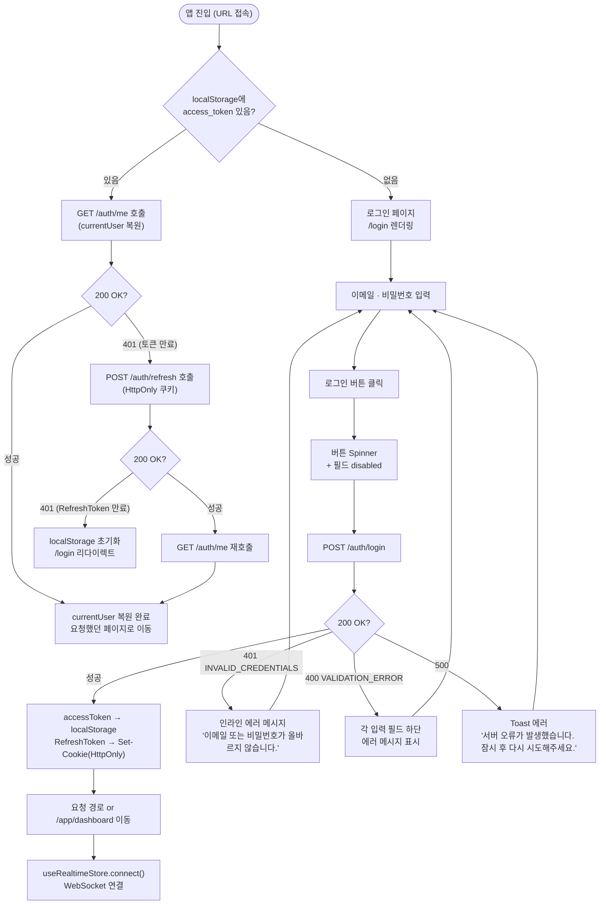
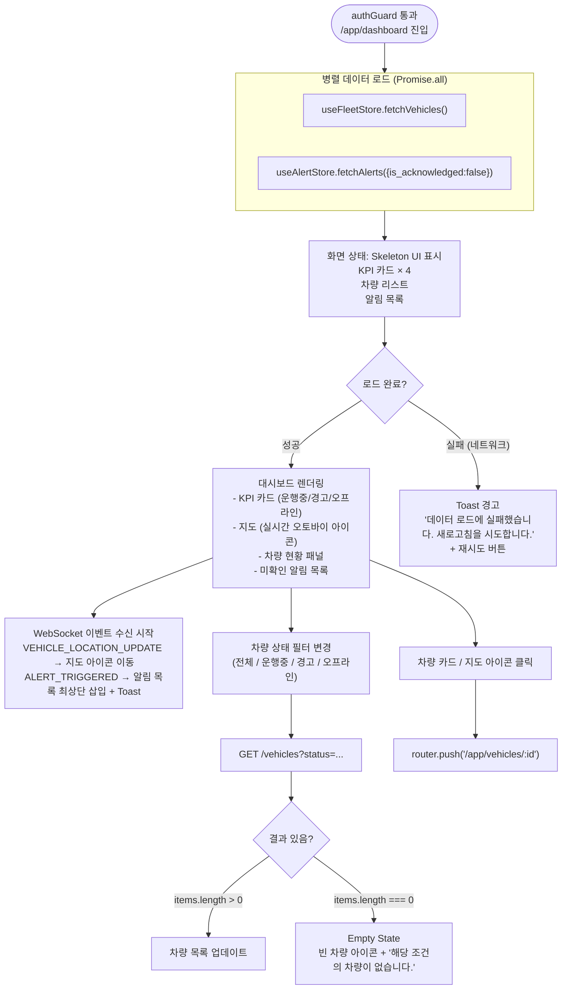
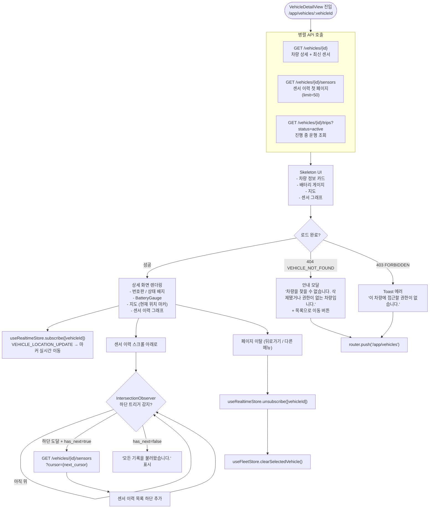
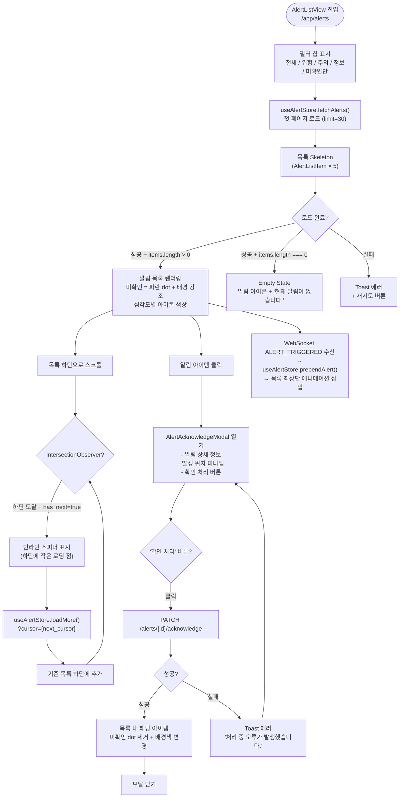
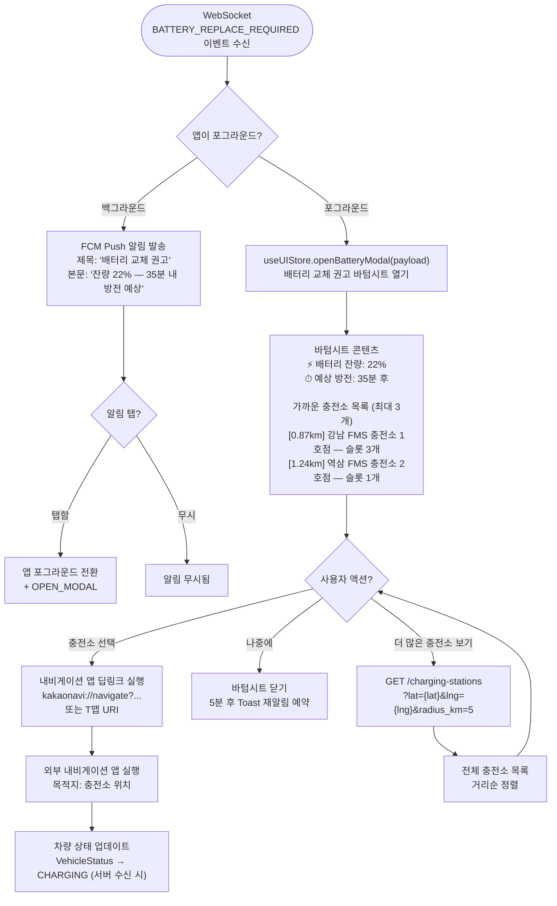
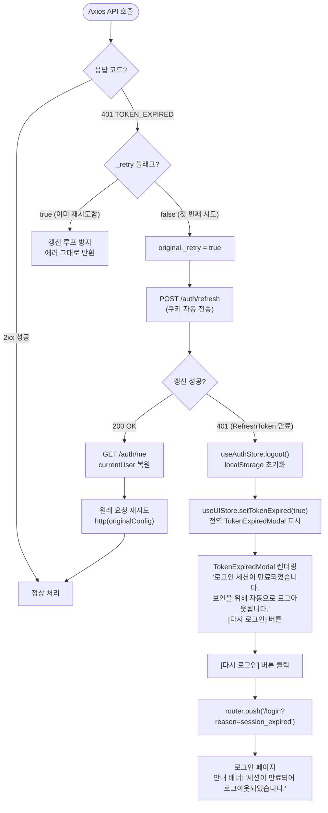
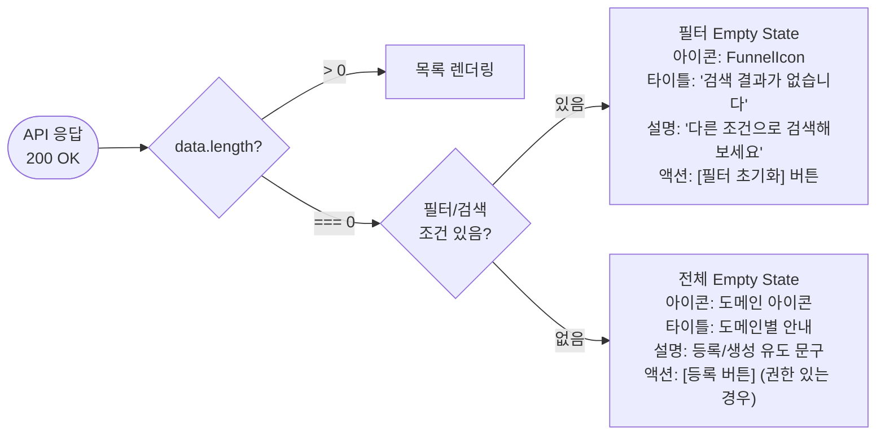
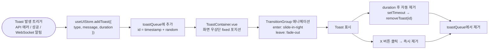

# 17. UX Flow — 사용자 경험 및 예외 처리 흐름도

> **대상 화면**: 관제 대시보드 (Web) + 모바일 앱 (App)  
> **원칙**: 모든 비동기 상태(로딩, 에러, 빈 결과)에 대해 명시적인 UX 분기를 정의합니다.

---

## 목차

1. [Flow 1 — 로그인 및 토큰 생명주기](#flow-1--로그인-및-토큰-생명주기)
2. [Flow 2 — 관제 대시보드 진입 및 차량 선택](#flow-2--관제-대시보드-진입-및-차량-선택)
3. [Flow 3 — 차량 상세 및 센서 이력 조회](#flow-3--차량-상세-및-센서-이력-조회)
4. [Flow 4 — 알림 목록 및 처리 (무한 스크롤)](#flow-4--알림-목록-및-처리)
5. [Flow 5 — 배터리 교체 권고 (모바일 앱)](#flow-5--배터리-교체-권고-모바일-앱)
6. [예외 처리 UX 공통 가이드](#예외-처리-ux-공통-가이드)
   - 6.1 API 응답 지연 — Skeleton UI
   - 6.2 인증 토큰 만료 — 자동 갱신 및 만료 모달
   - 6.3 빈 결과 — Empty State 디자인

---

## Flow 1 — 로그인 및 토큰 생명주기



---

## Flow 2 — 관제 대시보드 진입 및 차량 선택



---

## Flow 3 — 차량 상세 및 센서 이력 조회



---

## Flow 4 — 알림 목록 및 처리



---

## Flow 5 — 배터리 교체 권고 (모바일 앱)



---

## 예외 처리 UX 공통 가이드

### 6.1 API 응답 지연 — Skeleton UI

**원칙**: 로딩 상태는 즉시 표시하되, 300ms 미만은 깜빡임을 방지하기 위해 스켈레톤을 지연 표시합니다.

```typescript
// src/composables/useDelayedLoading.ts
import { ref, watch } from "vue"

/**
 * 로딩 상태를 지연 표시하는 컴포저블.
 *
 * @param source  - isLoading ref 또는 getter 함수
 * @param delay   - 스켈레톤 표시 지연 시간 (ms, 기본 300)
 *
 * 동작:
 *   - 로딩 시작 → delay ms 후에 showLoading = true
 *   - 로딩 완료 → 즉시 showLoading = false (타이머 취소)
 *   - 300ms 이내에 완료되면 스켈레톤 UI가 전혀 보이지 않습니다.
 */
export function useDelayedLoading(source: () => boolean, delay = 300) {
  const showLoading = ref(false)
  let timer: ReturnType<typeof setTimeout> | null = null

  watch(source, (loading) => {
    if (loading) {
      timer = setTimeout(() => { showLoading.value = true }, delay)
    } else {
      if (timer) clearTimeout(timer)
      showLoading.value = false
    }
  }, { immediate: true })

  return { showLoading }
}
```

**컴포넌트 적용 예시**

```vue
<!-- VehicleListView.vue -->
<template>
  <div>
    <!-- 300ms 이상 로딩 시에만 스켈레톤 표시 -->
    <template v-if="showLoading">
      <BaseSkeleton v-for="i in 5" :key="i" class="h-20 rounded-lg mb-3" />
    </template>

    <!-- 로딩 완료 + 결과 있음 -->
    <template v-else-if="!isLoading && vehicles.length > 0">
      <VehicleListItem
        v-for="vehicle in vehicles"
        :key="vehicle.id"
        :vehicle="vehicle"
        @select="onSelectVehicle"
      />
    </template>

    <!-- 로딩 완료 + 결과 없음 -->
    <BaseEmptyState
      v-else-if="!isLoading && vehicles.length === 0"
      icon="TruckIcon"
      title="차량이 없습니다"
      description="등록된 차량이 없거나 검색 조건에 맞는 차량이 없습니다."
    />
  </div>
</template>

<script setup lang="ts">
import { storeToRefs } from "pinia"
import { useFleetStore } from "@/stores/fleet"
import { useDelayedLoading } from "@/composables/useDelayedLoading"

const fleetStore = useFleetStore()
const { vehicles, isListLoading: isLoading } = storeToRefs(fleetStore)
const { showLoading } = useDelayedLoading(() => isLoading.value)
</script>
```

**스켈레톤 디자인 규격**

| 컴포넌트 | 스켈레톤 크기 | 반복 수 |
|---|---|---|
| KPI 카드 (Stat Card) | `h-24 w-full rounded-lg` | 4개 |
| 차량 리스트 아이템 | `h-20 w-full rounded-lg` | 5개 |
| 알림 리스트 아이템 | `h-16 w-full rounded-md` | 5개 |
| 차량 상세 카드 | `h-40 w-full rounded-lg` | 1개 |
| 센서 그래프 영역 | `h-48 w-full rounded-lg` | 1개 |

```vue
<!-- BaseSkeleton.vue — 펄스 애니메이션 스켈레톤 -->
<template>
  <div
    class="animate-pulse bg-secondary-200 dark:bg-secondary-700 rounded"
    :class="[$attrs.class]"
  />
</template>
```

---

### 6.2 인증 토큰 만료 — 자동 갱신 및 만료 모달



**TokenExpiredModal 컴포넌트**

```vue
<!-- src/components/global/TokenExpiredModal.vue -->
<template>
  <BaseModal
    :model-value="showTokenExpiredModal"
    title="세션 만료"
    size="sm"
    :close-on-backdrop="false"  <!-- 강제 모달 — 배경 클릭으로 닫기 불가 -->
  >
    <div class="flex flex-col items-center gap-4 py-2 text-center">
      <div class="w-14 h-14 rounded-full bg-warning-100 flex items-center justify-center">
        <LockClosedIcon class="w-7 h-7 text-warning-500" />
      </div>
      <p class="text-sm text-secondary-600 dark:text-secondary-300">
        로그인 세션이 만료되었습니다.<br />
        보안을 위해 자동으로 로그아웃 처리되었습니다.
      </p>
    </div>
    <template #footer>
      <BaseButton variant="solid-primary" size="md" class="w-full" @click="goToLogin">
        다시 로그인
      </BaseButton>
    </template>
  </BaseModal>
</template>

<script setup lang="ts">
import { storeToRefs } from "pinia"
import { useRouter } from "vue-router"
import { useUIStore } from "@/stores/ui"

const router  = useRouter()
const uiStore = useUIStore()
const { showTokenExpiredModal } = storeToRefs(uiStore)

function goToLogin() {
  uiStore.setTokenExpired(false)
  router.push("/login?reason=session_expired")
}
</script>
```

---

### 6.3 빈 결과 — Empty State 디자인

**원칙**: "아무것도 없음"은 오류가 아닙니다. 사용자가 다음 행동을 알 수 있도록 안내합니다.



**Empty State 도메인별 메시지 정의**

| 화면 | 아이콘 | 타이틀 | 설명 | 액션 버튼 |
|---|---|---|---|---|
| 차량 목록 (전체) | `TruckIcon` | 등록된 차량이 없습니다 | 새 차량을 등록하면 이곳에 표시됩니다 | [차량 등록] (ADMIN/MANAGER) |
| 차량 목록 (필터) | `FunnelIcon` | 검색 결과가 없습니다 | 선택한 상태에 해당하는 차량이 없습니다 | [필터 초기화] |
| 알림 목록 (전체) | `BellSlashIcon` | 알림이 없습니다 | 모든 차량이 정상 운행 중입니다 | — |
| 알림 목록 (미확인) | `CheckCircleIcon` | 미확인 알림이 없습니다 | 모든 알림을 확인했습니다 | — |
| 운행 기록 | `MapIcon` | 운행 기록이 없습니다 | 이 차량의 운행 기록이 없습니다 | — |
| 센서 데이터 | `ChartBarIcon` | 센서 데이터가 없습니다 | 선택한 기간에 데이터가 없습니다 | [기간 변경] |

```vue
<!-- BaseEmptyState.vue -->
<template>
  <div class="flex flex-col items-center justify-center gap-4 py-12 px-6 text-center">
    <!-- 아이콘 -->
    <div class="w-16 h-16 rounded-full bg-secondary-100 dark:bg-secondary-700
                flex items-center justify-center">
      <component :is="resolvedIcon" class="w-8 h-8 text-secondary-400 dark:text-secondary-500" />
    </div>

    <!-- 텍스트 -->
    <div class="flex flex-col gap-1">
      <h3 class="text-base font-semibold text-secondary-700 dark:text-secondary-300">
        {{ title }}
      </h3>
      <p class="text-sm text-secondary-400 dark:text-secondary-500 max-w-xs">
        {{ description }}
      </p>
    </div>

    <!-- 액션 버튼 (선택) -->
    <BaseButton
      v-if="actionLabel"
      variant="outline-primary"
      size="md"
      @click="$emit('action')"
    >
      {{ actionLabel }}
    </BaseButton>
  </div>
</template>

<script setup lang="ts">
import { computed } from "vue"
import * as HeroIcons from "@heroicons/vue/24/outline"

const props = defineProps<{
  icon:          string
  title:         string
  description:   string
  actionLabel?:  string
}>()

defineEmits<{ action: [] }>()

const resolvedIcon = computed(() => (HeroIcons as any)[props.icon] ?? HeroIcons.InboxIcon)
</script>
```

---

## 전역 Toast 시스템



**Toast 타입별 규격**

| 타입 | 지속 시간 | 색상 | 사용 상황 |
|---|---|---|---|
| `success` | 3,000ms | 초록 | 저장 완료, 알림 확인 처리 |
| `info` | 3,000ms | 파란 | 일반 안내, 상태 변경 알림 |
| `warning` | 5,000ms | 노랑 | 배터리 부족, 주의 알림 |
| `error` | 7,000ms | 빨강 | API 오류, 과속 감지 |

```typescript
// src/composables/useToast.ts
import { useUIStore } from "@/stores/ui"

export function useToast() {
  const uiStore = useUIStore()
  return {
    success: (message: string) => uiStore.addToast({ type: "success", message, duration: 3000 }),
    info:    (message: string) => uiStore.addToast({ type: "info",    message, duration: 3000 }),
    warning: (message: string) => uiStore.addToast({ type: "warning", message, duration: 5000 }),
    error:   (message: string) => uiStore.addToast({ type: "error",   message, duration: 7000 }),
  }
}
```

---

## 전역 예외 처리 매트릭스

| 에러 코드 | HTTP | UX 처리 방식 | 위치 |
|---|---|---|---|
| `TOKEN_EXPIRED` | 401 | 자동 갱신 시도 → 실패 시 TokenExpiredModal | 전역 (Axios 인터셉터) |
| `TOKEN_INVALID` | 401 | 강제 로그아웃 → 로그인 페이지 | 전역 |
| `FORBIDDEN` | 403 | Toast 에러 + /403 페이지 이동 | 전역 |
| `VEHICLE_NOT_FOUND` | 404 | 안내 모달 + 목록으로 이동 | VehicleDetailView |
| `DUPLICATE_PLATE` | 409 | 폼 인라인 에러 메시지 | 차량 등록 폼 |
| `DUPLICATE_EMAIL` | 409 | 폼 인라인 에러 메시지 | 사용자 등록 폼 |
| `VEHICLE_HAS_DATA` | 422 | Toast 에러 + 상세 안내 텍스트 | 차량 삭제 확인 모달 |
| `DRIVER_ALREADY_ASSIGNED` | 422 | Toast 에러 | 배차 변경 폼 |
| `VALIDATION_ERROR` | 400 | 각 필드 하단 에러 메시지 | 모든 폼 |
| `INTERNAL_ERROR` | 500 | Toast 에러 '서버 오류, 잠시 후 재시도' | 전역 |
| 네트워크 오류 | — | Toast 에러 '네트워크 연결을 확인해주세요' | 전역 |

---

> **개정 이력**  
> - v1.0 (2026-04-13): 초안 작성 — Flow 5개, 예외 처리 가이드 3종, Toast 시스템, 전역 에러 매트릭스
